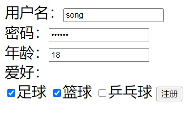
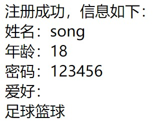
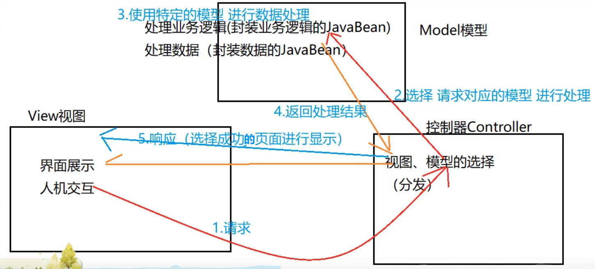
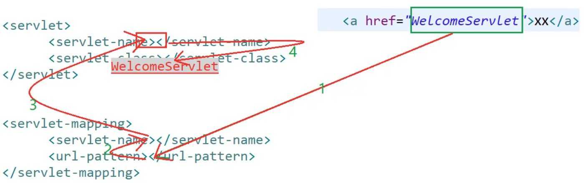
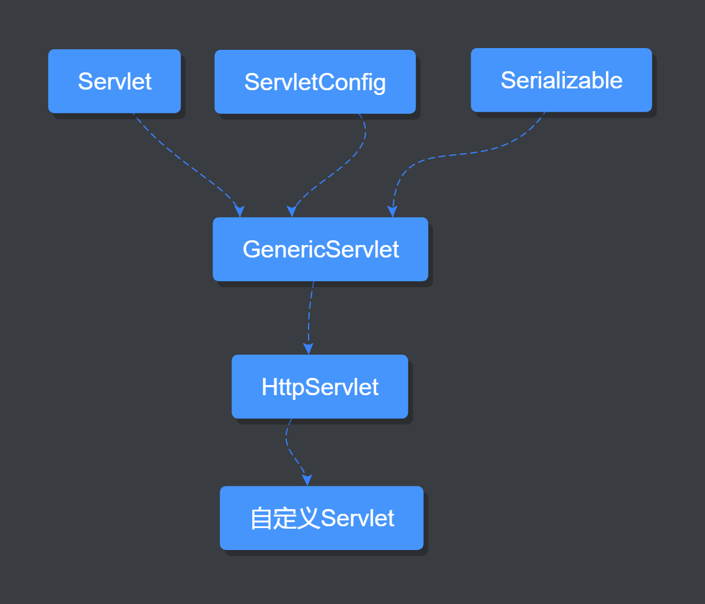
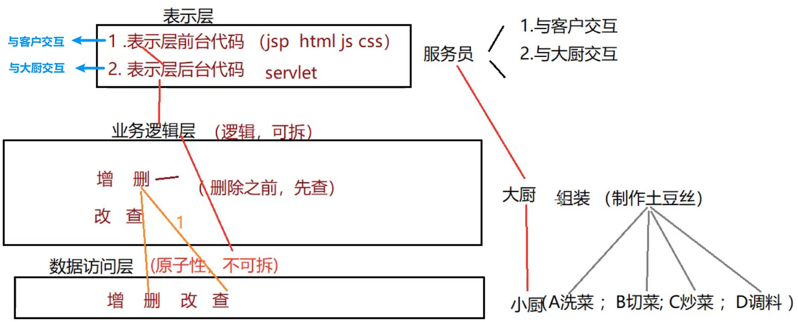
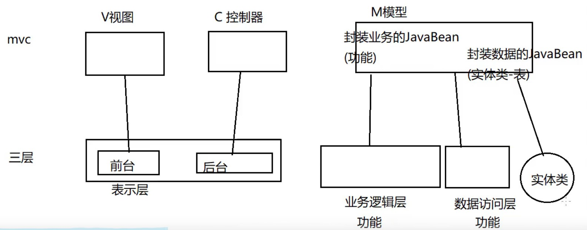
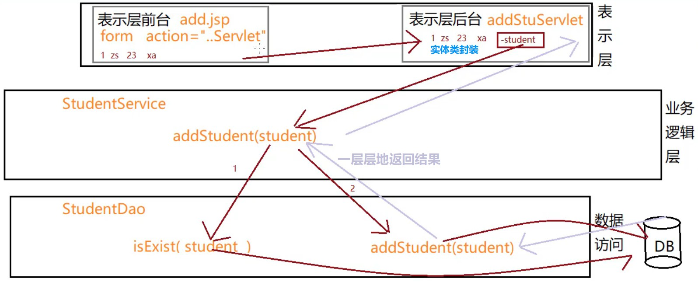
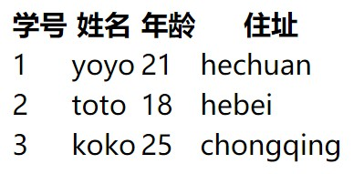

# jsp环境搭建及入门

## 动态网页与静态网页

动态或静态不是已网页有没有炫酷的动效来决定的，而是要看网页是否随着时间、地点、用户操作的改变而改变

动态网页需要用到服务端脚本语言 JSP

JSP：在 html 中嵌套的 java 代码

## Tomcat目录介绍

- bin ：开启和关闭
- conf：配置文件（server.xml）
- lib：tomcat依赖的 jar 文件
- log：日志文件（记录出错等信息）
- temp：临时文件
- webapps：可执行的项目（将我们开发的项目放入该目录）
- work：存放由 jsp 翻译成的 java，以及编辑成的 class 文件（jsp -> java -> class）

## 配置Tomcat

1. 配置 JDK（必须配置JAVA_HOME），其他的 classPath 和 path 也尽量配置
2. 配置 Tomcat
   - 配置 CATALINA_HOME：在系统环境变量中添加 CATALINA_HOME，值为 tomcat 根目录
   - 运行 tomcat 的 bin 目录下的 startup.bat 文件，可查看是否配置成功（.sh 文件为 linux 系统所用）
   - 关闭 tomcat：运行 bin 目录下的 shutdown.bat 文件即可
   - tomcat启动中文为乱码的问题，解决方法：将conf文件下的logging.properties文件中的java.util.logging.ConsoleHandler.encoding = UTF-8 的值改为 GBK
3. 修改 Tomcat 默认端口号
   - 因为 tomcat 默认端口号为 8080，所以很有可能与其他服务端所用端口号冲突，建议进行修改
   - 修改方式：进入 conf 文件夹，找到 server.xml 文件，将 Connector 属性的值修改为 8888 即可
4. 访问 Tomcat
   - 在启动 tomcat 服务后，在浏览器访问 localhost:8888 地址
   - 如果是 IE 浏览器，地址前面需要加 http:// 前缀

## 常见状态码

- 404：资源不存在
- 200：一切正常
- 403：权限不足（如访问了设置为不可见的目录）
- 300/301：页面重定向
- 500：服务器内部错误（代码有误）

## 访问自己的项目

如果想要将自己的项目放到 tomcat 服务器并进行访问，我们可以将项目放到 webapps 目录下，但是项目文件夹下必须有 WEB-INF 文件夹（可以去复制 ROOT 目录下自带的），里面还要有 web.xml 配置文件，一般还会在里面创建 classes 文件夹（存放由 jsp 编译为 java 再编译成的 class 文件）和 lib 文件夹（第三方依赖库，jar 包）。

如果将 jar 包放到 tomcat 根目录下的 lib 文件夹，则所有的 tomcat 项目都可以依赖该 jar 包，而 WEB-INF 内的 lib 是为单个项目依赖的 jar 包

# 虚拟路径和虚拟主机

访问 tomcat 时会自动导航至 webapps 目录，该目录就是一个虚拟路径

## 配置虚拟路径（方式一）

进入 server.xml 文件，对以下代码进行修改：

```xml
      <Host name="localhost"  appBase="webapps"
            unpackWARs="true" autoDeploy="true">
        <Valve className="org.apache.catalina.valves.AccessLogValve" directory="logs"
               prefix="localhost_access_log" suffix=".txt"
               pattern="%h %l %u %t &quot;%r&quot; %s %b" />
        <!-- 在此处添加： -->
        <Context docBase="E:\JAVA\apache-tomcat-9.0.39\webapps\jspProject" 		                                path="/jspPreject" />
      </Host>
```

参数解释：

- docBase：实际路径
- path：虚拟路径（相对于 webapps 的相对路径）

也就是说，当我们在浏览器访问 `localhost:8888\jspProject` 的时候，会自动跳转到 `E:\JAVA\apache-tomcat-9.0.39\webapps\jspProject`

使用该方法配置后需要重启 tomcat 才能生效

## 配置虚拟路径（方式二）

进入 conf 目录，进入 Catalina -> localhost，在该文件夹下新建 `项目名.xml` 文件，如 `jspProject.xml`，然后再里面进行配置：

```xml
<Context docBase="E:\JAVA\apache-tomcat-9.0.39\webapps\jspProject" path="/jspPreject" />
```

只需书写这一行代码即可，并且无需重启 tomcat

## 配置虚拟主机

假如我们访问 `www.jd.com` 时，会现在本机电脑上解析该域名，然后通过万网 / 新网 / 西部数码的域名解析器解析为 IP 地址，再去访问到对应的主机

但是我们可以在本机电脑上解析时，为其配置虚拟主机，就可以访问到本地的 `www.jd.com`

配置方式：进入 conf 下的 server.xml 文件，对 Engine 标签做出修改：

```xml
   	<!-- 2. 将defaultHost改为www.jd.com -->
		<Engine name="Catalina" defaultHost="localhost">

      <Realm className="org.apache.catalina.realm.LockOutRealm">
        <Realm className="org.apache.catalina.realm.UserDatabaseRealm"
               resourceName="UserDatabase"/>
      </Realm>
      <!-- 1. 在此处新增一个Host标签 -->
      <Host name="www.jd.com" appBase="E:\JAVA\apache-tomcat-9.0.39\webapps\jspProject">
      	<Context docBase="E:\JAVA\apache-tomcat-9.0.39\webapps\jspProject" path="/">
      </Host>
        
      <Host name="localhost"  appBase="webapps"
            unpackWARs="true" autoDeploy="true">
        <Valve className="org.apache.catalina.valves.AccessLogValve" directory="logs"
               prefix="localhost_access_log" suffix=".txt"
               pattern="%h %l %u %t &quot;%r&quot; %s %b" />
      </Host>
    </Engine>
```

然后前往系统的 system32 目录，对 hosts 文件做出修改：

```
添加字段：
127.0.0.1  www.jd.com
```

网站的默认端口都是 80，比如访问 `www.163.com` 和访问 `www.163.com:80` 的结果是一样的，因此要将我们自定义的 8888 端口修改为 80，此时就可以不加端口号直接访问我们的主机

完成以上所有操作后，重启 tomcat 服务器即可

# JSP执行流程

第一次请求：

- 当服务器上的一个JSP页面被第一次请求执行时，服务器上的JSP引擎首先将JSP页面文件转译成一个.java文件，也就是servlet，并编译这个java文件生成.class的字节码文件，然后执行字节码文件响应客户端的请求。

再次请求：

- JSP引擎将直接执行字节码文件来响应客户。

如果已经编译过的文件进行了修改，则下一次请求时需要重新编译

# 使用IDEA快速开发Tomcat

## IDEA继承Tomcat

首先要在IDEA中集成Tomcat

选择 run -> Edit Configurations -> 点击左上角+号 -> 选择Tomcat Server 下的 Local，然后在里面配置Tomcat根路径即可

## 创建Tomcat WEB项目

new -> project -> 左侧选择 Java Enterprise -> Web Application

## 配置Tomcat运行时环境

目前的项目只能编译 JSP，无法编译 Servlet，为了解决这一点，我们需要导入 jar 包：

前往 Tomcat 的 lib 目录下，导入 servelet-api.jar

## 统一字符集编码

1. 设置 JSP 文件的编码（JSP 翻译为 java 文件时使用的编码）：设置 jsp 文件中的 pageEncoding 属性设置为 UTF-8

   ```jsp
   <%@ page language="java" contentType="text/html; charset=UTF-8" pageEncoding="UTF-8"%>
   ```

2. 设置浏览器读取 jsp 文件的编码：设置 jsp 文件中的 `<meta>` 标签的 `content` 属性设置为 UTF-8
3. 设置 jsp 文件本身的编码

## 运行Tomcat项目

在 IDEA 上方的运行按钮旁边的一栏选择 Tomcat，之后点击运行按钮即可自动运行项目并弹出网页

且对代码进行修改之后不再需要重启 Tomcat 服务

> WEB_INF中的文件无法通过客户端（浏览器）直接访问，只能通过请求转发来访问
>
> 注意：
>
> - 并不是任何内部的跳转都可以访问WEB-INF，比如另一种跳转方式——重定向就不可访问

# JSP页面元素及request对象

## JSP中的页面元素

1. 脚本 Scriptlet

   - ① 定义局部变量和编写常规 java 代码 `<% %>`

     ```jsp
     <%
     	String name = "List";
     	out.print("HELLO WORLD");
     	init();
     %>
     ```

     注意：`out.println()` 是无法实现换行的，但是我们可以通过嵌入 HTML 标签来实现换行

     ```jsp
     <%= "HELLO <br/> WORLD" %>
     ```
   
     当然，其他的 HTML 标签也可以嵌入到脚本中：
   
     ```java
     <%
     	out.print("<font clolr='red'> HELLO </font>");  
     %>
     ```
     
   - ② 定义全局变量和方法 `<%! %>`
   
     ```jsp
      <%!
         // 定义全局变量
        public String bookName;
     // 定义方法
       public void init(){
          bookName = "java";
        }
      %> 
     ```
   
   - ③ 输出表达式 `<%= %>`
   
     ```jsp
     <%=
       "hello" + bookName  // 不需要加分号
     %>
     ```
2. HTML 代码

3. 指令

   ① page 指令

   ```jsp
   <%@ page language="java" contentType="text/html; charset=UTF-8" pageEncoding="UTF-8" import="java.util.Date" %>
   ```

   - language：jsp 页面使用的脚本语言
   - import：导入类
   - pageEncoding：jsp 编译为 java 时使用的编码
   - contentType：浏览器解析 jsp 时使用的编码

4. 注释

   - HTML 注释：`<!-- -->`，写在脚本外部，查看浏览器源代码可以看到
   - java 注释：`//`，`/* */`，写在脚本内部，浏览器源代码看不见
   - jsp 注释：`<%-- --%>`，写在脚本外部，浏览器源代码看不见

## JSP 内置对象

JSP 内置对象：自带的，不需要 new 也能使用的对象

1. out：输出对象——向客户端输出内容
2. pageContext：JSP 页面容器
3. request：请求对象——存储客户端向服务端发送的请求信息的**对象**
   - 常见方法：
   - `String getParameter(String name)`：根据请求的字段值 name（key），返回 字段值 value
   - `String[] getParameterValues(String name)`：根据字段值 key 返回多个 value 值，常见于复选框
   - `void setCharacterEncoding("UTF-8")`：设置请求编码，若不设置则指定 Tomcat 默认编码
   - `void getRequestDispatcher("b.jsp").forward(request, response)`：以请求转发的方式跳转至 B 页面
   - `ServletContext getServerContext()`：获取项目的 ServletContext 对象
   - `Cookie[] getCookies()`：客户端获取 Cookie 对象
4. response：响应对象
   - `void addCookie(Cookie cookie)`：服务端将 cookie 添加到 response 对象中，response 返回响应时会携带 cookie 一起返回客户端
   - `void sendRedirect(String location) throws IOException`：重定向方式进行页面跳转
   - `void setContentType(String type)`：设置服务端响应的编码（设置服务端的 ContentType 类型）
5. session：会话对象
6. application：全局对象
7. config：配置对象（服务器配置信息）
8. page：当前 JSP 页面对象，相当于 java 中的 this
9. exception：异常对象

### Request

**request 只在数据同一次请求时有效**

举例：在登陆页面输入用户名和密码，然后跳转到验证页面进行验证，此时可以通过 request 获取到用户名和密码

但是如果在地址栏通过回车键再一次进入验证页面，就无法通过 request 获取到用户名和密码，因为这已经是第二

次请求了

但是通过 F5 刷新的方式进入验证页面，依然可以访问到，因为刷新相当于重新提交了一次表单

# 注册登陆案例

register.jsp：

```jsp
<%@ page contentType="text/html;charset=UTF-8" language="java" %>
<html>
<head>
    <title>Title</title>
</head>
<body>
    <form action="show.jsp">
        <%-- 此处的name就是getParameter的参数name --%>
        用户名：<input type="text" name="uname"><br>
        密码：<input type="password" name="upwd"><br>
        年龄：<input type="text" name="uage"><br>
        爱好：<br>
            <input type="checkbox" name="uhobbies" value="足球">足球
            <input type="checkbox" name="uhobbies" value="篮球">篮球
            <input type="checkbox" name="uhobbies" value="乒乓球">乒乓球
            <input type="submit" value="注册">
    </form>
</body>
</html>
```



show.jsp：

```jsp
<%@ page contentType="text/html;charset=UTF-8" language="java" %>
<html>
<head>
    <title>show</title>
</head>
<body>
    <%
        String name = request.getParameter("uname");
        int age = Integer.parseInt(request.getParameter("uage"));
        String pwd = request.getParameter("upwd");
        String[] hobbies = request.getParameterValues("uhobbies");
    %>
    注册成功，信息如下：<br>
    姓名：<%=name%><br>
    年龄：<%=age%><br>
    密码：<%=pwd%><br>
    爱好：<br>
    <%
        for (String hobby : hobbies) {
            out.print(hobby);
        }
    %>
</body>
</html>
```



## 修改GET请求编码

我们可以将所有的 GET 请求的编码修改为 UTF-8

进入 Tomcat 的 conf 文件夹，对 server.xml 文件做出以下修改：

```xml
<Connector port="8888" protocol="HTTP/1.1"
           connectionTimeout="20000"
           redirectPort="8443" 
           // 在下面添加URIEncoding属性：
           URIEncoding="UTF-8"/>
```

## 修改POST请求编码

```jsp
<!-- 设置POST请求的编码 -->
<%
		request.setCharacterEncoding("UTF-8");
%>
```

# Response、请求转发和重定向

## 登陆案例

案例：张三登陆成功后，提示 “欢迎你，张三”

login.jsp（登陆界面）：

```jsp
<%@ page contentType="text/html;charset=UTF-8" language="java" %>
<html>
<head>
    <title>login</title>
</head>
<body>
    <form action="check.jsp" method="post">
        用户名：<input type="text" name="uname"><br>
        密码：<input type="password" name="upwd"><br>
        <input type="submit" value="登陆"><br>
    </form>
</body>
</html>
```

check.jsp（验证界面）：

```jsp
<%@ page contentType="text/html;charset=UTF-8" language="java" %>
<html>
<head>
    <title>check</title>
</head>
<body>
    <%
        String uname = request.getParameter("uname");
        String upwd = request.getParameter("upwd");
        if("song".equals(uname)&&"123456".equals(upwd)){
            // 登陆成功，跳转到success.jsp页面
            response.sendRedirect("success.jsp");
        }else {
            // 登陆失败
            out.print("用户名或密码有误");
        }
    %>
</body>
</html>
```

success.jsp（登陆成功后跳转至的页面）：

```jsp
<%@ page contentType="text/html;charset=UTF-8" language="java" %>
<html>
<head>
    <title>scuuess</title>
</head>
<body>
登陆成功！<br>
欢迎您:
<%
    String uname = request.getParameter("uname");
    out.print(uname);
%>
</body>
</html>
```

当我们输入了正确的用户名和密码，可以顺利跳转至 success.jsp 页面，但是却提示 `欢迎您: null`，说明数据丢失了

因此，**用重定向的方式跳转页面会导致数据丢失**

这次我们使用请求转发的方式来跳转页面，修改 check.jsp 代码：

```jsp
<%
		// 源代码：
		response.sendRedirect("success.jsp");
		// 修改为：
		request.getRequestDispatcher("success.jsp").forward(request,response);
%>
```

最终打印：`欢迎您：song`，可以发现成功获取到数据

**使用请求转发的方式进行跳转后依然可以获取到转发前获取的数据，并且地址栏没有改变（仍然保留转发时的页面 check.jsp）**

## 重定向和请求转发的区别

在上面的案例中，使用重定向跳转会丢失数据，而使用请求转发跳转则会保留数据，原因：

- 使用重定向跳转时，第一次 login.jsp 带着数据访问 check.jsp，因为是重定向跳转，check.jsp 返回一条信息，说你找错人了，你应该找 success.jsp；login.jsp 收到这条消息后，重新访问 success.jsp，因此数据丢失，最后返回响应给 login.jsp
- 使用请求转发跳转时，login.jsp 带着数据访问 check.jsp，然后直接由 check.jsp 带着数据跳转至 success.jsp，最后直接返回响应给 login.jsp
- 重定向跳转请求了 2 次，而请求转发跳转只请求了 1 次

关于数据的保留与不保留问题，之后在四种范围对象章节详细讲解

# Cookie和Session

session：存在于服务端，是内置对象

cookie：存在于客户端，不是内置对象，需要在 `new` 之后才能使用

## Cookie

cookie 是由服务端产生的，再发送给客户端保存，相当于本地缓存的作用，以键值对的形式储存

客户端访问服务端，输入用户名和密码，然后服务端会将用户名和密码放到一个 cookie 里面，再发送给客户端，下一次就可以直接读取本地的 cookie 中的用户名和密码，就不用再自己登陆了

作用：提高访问服务端效率，但是安全性较差

### Cookie常用方法

cookie 不是内置对象，需要 `new` 之后使用，而被 `new` 的类就是 `javax.servlet.http.Cookie`

- `public Cookie(String name, String value)`：Cookie 类的构造方法
- `String getName()`：获取 name 值（也就是 key 值）
- `String getValue()`：获取 value 值
- `void setMaxAge(int expiry)`：设置最大有效期，也就是 cookie 在客户端存在的最大时间（秒）

### 服务端向客户端发送Cookie

步骤：

1. 服务端准备并添加 cookie 到 response 对象中
2. 页面跳转（转发，重定向）
3. 客户端获取 cookie
   - 注意：客户端获取 cookie 不能单独获取一个对象，必须一次性获取所有的 cookie

代码演示：

```jsp
// 服务端
<%@ page contentType="text/html;charset=UTF-8" language="java" %>
<html>
<head>
    <title>add</title>
</head>
<body>
<%
    // 1. 服务端准备并添加 cookie 到 response 对象中
    Cookie cookie1 = new Cookie("name","song");
    Cookie cookie2 = new Cookie("pwd","123456");
    response.addCookie(cookie1);
    response.addCookie(cookie2);

    // 2. 页面跳转到客户端（使用转发或重定向）
    response.sendRedirect("client.jsp");
%>
</body>
</html>
---------------------------------------------------------------------------------------
// 客户端
<%@ page contentType="text/html;charset=UTF-8" language="java" %>
<html>
<head>
    <title>client</title>
</head>
<body>
<%
    // 3. 客户端获取cookie
    Cookie[] cookies = request.getCookies();
    for (Cookie cookie : cookies) {
        out.print(cookie.getName());
        out.print(cookie.getValue());
    }
%>
</body>
</html>
```

客户端输出：

```jsp
name song
pwd 123456
JSESSIONID11B672DF42E1319F2FA29AFE4C0D1A45Idea-f2335b970259eca7-167f-4b4e-bf84-5cfe96f5e6c4
```

上面 JSESSIONID 产生的原因：

客户端在第一次请求服务端时，如果服务端发现此请求没有 JSESSIONID，则会 new 一个 name = JSESSIONID 的cookie，并返回给客户端

### 使用cookie记住用户名

```jsp
// 登陆login.jsp：
<%@ page contentType="text/html;charset=UTF-8" language="java" %>
<html>
<head>
    <title>login</title>
</head>
<body>
    <%!
        // 定义一个全局变量
        String uname;
    %>

    <%
        // 获取服务端响应的cookie
        Cookie[] cookies = request.getCookies();
        for (Cookie cookie : cookies) {
            // 如果cookie的key值为"name"，就把该cookie的value值赋值给全局变量name
            if("name".equals(cookie.getName())){
                uname=cookie.getValue();
            }
        }
    %>

    <form action="check.jsp" method="post">
        <!-- 将value的值替换为全局变量uname -->
        用户名：<input type="text" name="uname" value="<%=uname%>"><br>
        密码：<input type="password" name="upwd"><br>
        <input type="submit" value="登陆"><br>
    </form>
</body>
</html>
----------------------------------------------------------------------------------------
// 服务端check.jsp：
<%@ page contentType="text/html;charset=UTF-8" language="java" %>
<html>
<head>
    <title>check</title>
</head>
<body>
    <%
        // 获取login界面输入的用户名
        String uname = request.getParameter("uname");
        // 将用户名加入到cookie中
        Cookie cookie = new Cookie("name",uname);
        response.addCookie(cookie);
        // 通过重定向将cookie响应给客户端
        response.sendRedirect("client.jsp");
    %>
</body>
</html>
-----------------------------------------------------------------------------------------
// 客户端client.jsp：
因为是在本机电脑上进行测试，所以添加cookie后，其他网页可以直接获取到cookie
但是真实情况是需要由服务端将cookie响应给客户端的，因此我们创建一个client.jsp模拟客户端
<%@ page contentType="text/html;charset=UTF-8" language="java" %>
<html>
<head>
    <title>client</title>
</head>
<body>

</body>
</html>
```

## Session

session：一次会话

- 从浏览器的开启到关闭
- 一件商品的浏览 - 付款 -退出

## Session执行机制

客户端第一次请求服务端时，服务端就会在内部产生一个 session 对象（用于保存该客户的信息），该对象自带一个 SESSIONID（用于区分其他 session）

然后服务端会产生一个 cookie，并且该 cookie 的 name = JESSIONID，value = SESSIONID 

然后服务端会在响应客户端的同时将该 cookie 发送给客户端

至此，客户端的 cookie 可以通过 JESSIONID 与服务端的 session 一一对应起来

---

客户端第二次请求时，服务端会先用客户端 cookie 中的 JSESSIONID 和服务端 session 中的 SESSIONID 进行匹配，如果匹配成功则说明此用户不是第一次访问，就无需再次登陆

> 客户端第一次访问服务端时也进行了一次匹配，判定为该用户是第一次登陆后所以才产生一个 session 对象

注意：

1. session 存储在服务端
2. 同一个客户端多次访问服务端时共享同一个 session 对象
3. session 是 Object 类型，cookie 是 String 类型

### 常用方法

- `String getId()`：获取 SESSIONID
- `boolean isNew()`：判断客户端是不是第一次访问
- `void invalidate()`：使 session 失效（一般用于退出登陆、注销时）
- `void setAttribute()`
- `Object getAttribute()`
- `Object removeAttribute()`
- `void setMaxInactiveInterval(秒)`：设置最大有效、非活动时间（比如30分钟内未操作则需要重新登陆）
- `int getMaxInactiveInterval()`：获取最大有效、非活动时间

## session案例

session 肯定是在登陆成功之后才会创建的，因为里面要保存用户名密码等信息，我们用代码实现一下：

登陆页：

```jsp
<%@ page contentType="text/html;charset=UTF-8" language="java" %>
<html>
<head>
    <title>login</title>
</head>
<body>
<form action="check.jsp" method="post">
    用户名：<input type="text" name="uname"><br>
    密码：<input type="password" name="upwd"><br>
    <input type="submit" value="登陆"><br>
</form>
</body>
</html>
```

验证页：

```jsp
<%@ page contentType="text/html;charset=UTF-8" language="java" %>
<html>
<head>
    <title>check</title>
</head>
<body>
    <%
        String uname = request.getParameter("uname");
        String upwd = request.getParameter("upwd");
        if("song".equals(uname)&&"123456".equals(upwd)){
            // 登陆成功，创建session
            session.setAttribute("uname",uname);
            session.setAttribute("upwd",upwd);
            // 跳转至欢迎页
            request.getRequestDispatcher("welcome.jsp").forward(request,response);
        }else {
            // 登陆失败，回去重新登陆
            response.sendRedirect("login.jsp");
        }
    %>
</body>
</html>
```

欢迎页：

```jsp
<%@ page contentType="text/html;charset=UTF-8" language="java" %>
<html>
<head>
    <title>welcome</title>
</head>
<body>
欢迎您：
 <%
     String uname = (String)session.getAttribute("uname");
     // 如果用户没有登录，而是直接诶通过地址栏访问本欢迎页，则获取到的uname值必然是null
     // 如果uname是null，则自动返回登陆页
     if(name!=null){
         out.print(uname);
     }else{
       response.sendRedirect("login.jsp");
     }
 %>
</body>
</html>
```

## session共享问题

session 在同一次会话（浏览器的打开到关闭）中可以共享

在满足上述的条件下，打开多个相同的浏览器也可以共享 session

# application

- `getContentPath()`：获取虚拟路径

  ```jsp
  <%="虚拟路径："+application.getContextPath()%> 
  打印结果：/LearnTomcat_war_exploded
  ```

- `getRealPath(String 虚拟路径)`：获取绝对路径（虚拟路径所对应的绝对路径）

  ```jsp
  <%="虚拟路径对应的绝对路径："+application.getRealPath("/LearnTomcat_war_exploded")%>
  打印结果：E:\JAVA\ideaProject\learn\out\artifacts\LearnTomcat_war_exploded\LearnTomcat_war_exploded
  ```


# 四种范围对象

四种范围对象由小到大排列：

- `pageContext`：当前页面有效
  - 有时候也被叫做 page 对象，但是指的并不是内置对象中实际的 page 对象，只是 pageContext 的简称
- `request`：同一次请求有效
- `session`：同一次会话有效
- `application`：全局有效（整个项目有效）

## 共有方法

- `Object getAttribute(String name)`：根据属性名，获取属性值
- `void setAttribute(String name, Object obj)`：设置属性值（新增，修改）
  - `set Attribute("a", "b")`：如果 a 对象之前不存在，则新建一个 a 对象；如果已存在，则将 a 的值改为 b
- `void removeAttribute(String name)`：根据属性名删除对象

## pageContext

**测试：在本页面设置和获取属性**

a.jsp：

```jsp
<body>
<%
    // 设置属性值
    pageContext.setAttribute("hello","world");
%>
  
    // 在本页面获取属性值
    <%=pageContext.getAttribute("hello")%>
</body>

打印结果：world
```

**测试：在本页面设置属性，去其他页面获取属性**

a.jsp：

```jsp
<body>
<%
    pageContext.setAttribute("hello","world");
    request.getRequestDispatcher("b.jsp").forward(request,response);
%>
</body>
```

b.jsp：

```jsp
<body>
    <%=pageContext.getAttribute("hello")%>
</body>

// 打印结果：
null
```

## request

**测试：使用请求转发方式跳转页面，并获取属性**

a.jsp：

```jsp
<body>
<%
    // 为request对象设置属性值
    request.setAttribute("hello", "world");
    // 使用请求转发跳转页面
    request.getRequestDispatcher("b.jsp").forward(request, response);
%>
</body>
```

b.jsp：

```jsp
<body>
<%=request.getAttribute("hello")%>
</body>

// 打印结果：
world
```

**测试：使用重定向方式跳转页面，并获取属性**

a.jsp：

```jsp
<%
    // 为request对象设置属性值
    request.setAttribute("hello", "world");
    // 使用重定向方式跳转页面
    response.sendRedirect("b.jsp");
%>
```

b.jsp：

```jsp
<body>
<%=request.getAttribute("hello")%>
</body>

// 打印结果：
null
```

重定向与请求转发的跳转方式我们前面已经介绍过，因为请求转发是将本次请求转发到了另一个页面，因此依然是同一次请求，所以可以获取到属性；

而重定向是发起了第二次请求，而 request 是同一次请求有效，所以无法获取到属性

## session

范围：同一次会话有效

```jsp
<%
    // 为session对象设置属性值
    session.setAttribute("hello", "world");
    // 使用请求转发方式跳转页面
    request.getRequestDispatcher("b.jsp").forward(request, response);
    // 使用重定向方式跳转页面
    response.sendRedirect("c.jsp");
%>

// b.jsp打印：world
// c.jsp打印：world
```

## application

全局变量：整个项目运行期间都有效，即使切换浏览器也仍然有效

```jsp
<%
    // 为session对象设置属性值
    application.setAttribute("hello", "world");
    // 使用请求转发方式跳转页面
    request.getRequestDispatcher("b.jsp").forward(request, response);
    // 使用重定向方式跳转页面
    response.sendRedirect("c.jsp");
%>

// b.jsp打印：world
// c.jsp打印：world
// 更换IE浏览器访问b.jsp：world
// 更换IE浏览器访问c.jsp：world
```

application 在关闭服务、重启服务（尚未重新为其赋值）后，或在其他项目中都是无效的

如果想要在重启服务后或在多个项目中共享 application，需要用到 JNDI 技术

## 总结

**以上范围对象，尽量使用最小的范围，因为对象的范围越大，造成的性能损耗就越大**

# JSP访问数据库

## Tomcat的jar包导入

将 jar 包拷贝到 Tomcat 所在目录的 lib 文件夹下，然后重启项目

如果是仍不行，则在 WEB-INF 文件夹下新建 lib 包，把 jar 包拷贝进去

## 登陆案例

用户在网页中填写用户名和密码，然后通过 JSP 访问数据库来判定用户输入是否正确

login.jsp：

```jsp
<body>
<form action="check.jsp" method="post">
    用户名：<input type="text" name="uname"><br>
    密码：<input type="password" name="upwd"><br>
    <input type="submit" value="登陆">
</form>
</body>
```

check.jsp：

```jsp
<!-- 导包 -->
<%@ page import="java.sql.Connection" %>
<%@ page import="java.sql.PreparedStatement" %>
<%@ page import="java.sql.ResultSet" %>
<%@ page import="java.sql.DriverManager" %>

<body>
<%
    String url = "jdbc:oracle:thin:@localhost:1521:orcl";
    String user = "system";
    String password = "123456";
    Class.forName("oracle.jdbc.driver.OracleDriver");
    Connection conn = DriverManager.getConnection(url, user, password);
    String uname = request.getParameter("uname");
    String upwd = request.getParameter("upwd");
    PreparedStatement ps = conn.prepareStatement("select * from users where uname = ? and upwd = ?");
    ps.setObject(1, uname);
    ps.setObject(2, upwd);
    ResultSet rs = ps.executeQuery();
    if (rs.next()) {
        out.print("登陆成功");
    } else {
        out.print("登陆失败");
    }
%>
</body>
```

# JavaBean

通过上面的登陆案例，我们发现用 JSP 访问数据库时，将 java 代码嵌套到了 jsp 文件中

但是我们希望 java 代码就写到 java 文件中，jsp 文件中尽量只存在 jsp 代码

**好处：**

1. 降低 jsp 复杂度
2. 提高代码复用性（其他地方也可以进行调用）

**JavaBean 的定义：**

1. 必须是 public 修饰的类，并且是 public 修饰的无参构造
2. 所有属性都是 private 修饰，并且提供 setter and getter

**JavaBean 种类：**

1. 封装模型的 JavaBean（如 StudentModel.java）
2. 封装业务逻辑的 JavaBean（如 LoginDao.java）

## Dao类封装

> 如果某个类是专门用来操作数据库的，则要在其类名后添加 Dao

在 **src** 目录下新建 dao 包（注意必须要创建一个包来保存一个类，如果直接在 src 下创建类，那么在导包时会出问题）

在该包中创建 LoginDao.java：

```java
package dao;

import java.sql.Connection;
import java.sql.DriverManager;
import java.sql.PreparedStatement;
import java.sql.ResultSet;

public class LoginDao {
    // 我们在jsp中可以通过内置对象request来获取表单中的uname和upwd，但是java中无法做到
    // 因此需要通过方法参数的形式来获取
    public boolean loginCheck(String uname, String upwd) {
        Connection conn = null;
        PreparedStatement ps = null;
        ResultSet rs = null;
        try {
            String url = "jdbc:oracle:thin:@localhost:1521:orcl";
            String user = "system";
            String password = "123456";
            Class.forName("oracle.jdbc.driver.OracleDriver");
            conn = DriverManager.getConnection(url, user, password);
            ps = conn.prepareStatement("select * from users where uname = ? and upwd = ?");
            ps.setObject(1, uname);
            ps.setObject(2, upwd);
            rs = ps.executeQuery();
            // java也无法通过out实现在网页中输出
            // 但我们可以通过返回值来告知jsp文件是否登陆成功，让jsp在网页中打印结果
            if (rs.next()) {
                // out.print("登陆成功");
                return true;
            } else {
                // out.print("登陆失败");
                return false;
            }
        } catch (Exception e) {
            e.printStackTrace();
            return false;
        } finally {
            try {
                // 释放资源
                rs.close();
                ps.close();
                conn.close();
            } catch (Exception e) {
                e.printStackTrace();
            }
        }
    }
}
```

login.jsp：

```jsp
<form action="check.jsp" method="post">
    用户名：<input type="text" name="uname"><br>
    密码：<input type="password" name="upwd"><br>
    <input type="submit" value="登陆">
</form>
```

check.jsp：

```jsp
<!-- 导包（包名.类名） -->
<%@ page import="dao.LoginDao" %>

<body>
<%
    String uname = request.getParameter("uname");
    String upwd = request.getParameter("upwd");
    // 调用LoginDao中的loginCheck方法，将表单提交过来的uname和upwd作为参数传递过去
    LoginDao loginDao = new LoginDao();
    boolean res = loginDao.loginCheck(uname, upwd);
    if (res) {
        out.print("登陆成功！");
    } else {
        out.print("登陆失败");
    }
%>
</body>
```

# MVC设计模式

## 介绍

M：Model（模型），用来储存模型或 Dao，使用 JavaBean 实现

V：View（视图），用户界面展示以及与用户交互，使用 H5、C3、JS、JSP 等前端技术实现

C：Controller（控制器），接收 View 层发起的请求，将其跳转到 Model 层进行处理。Model 处理完毕后，再将处理的结果返回给请求处。可以用 JSP 实现，但是一般建议使用 Servlet 来实现

## 执行流程

图解：



# Servlet

Servlet 是一个 java 类，但是并不是所有的 java 类都是 Servlet

如果一个 java 类符合一定的格式或规范，那么它就是一个 Servlet

Servlet 规范：

1. 必须继承 `javax.servlet.http.HttpServlet` 类
2. 重写该类中的 `doGet()` 或 `doPost()` 方法
   - doGet()：接收并处理所有 get 方式提交的请求
   - doPost()：接收并处理所有 post 方式提交的请求

## 创建与请求Servlet类

创建 Servlet 类：

```java
import javax.servlet.http.HttpServlet;
import javax.servlet.http.HttpServletRequest;
import javax.servlet.http.HttpServletResponse;
// 1. 继承HttpServlet
public class WelcomeServlet extends HttpServlet {
    // 2. 重写doGet()和doPost()方法
    @Override
    protected void doGet(HttpServletRequest req, HttpServletResponse resp) {
        System.out.println("doGet");
    }

    @Override
    protected void doPost(HttpServletRequest req, HttpServletResponse resp) {
        System.out.println("doPost");
    }
}
```

> 每一个功能都需要对应一个 Servlet，假如有增删改 3 个功能，则需要创建 3 个 Servlet

请求 Servlet 类：

```jsp
<body>
<a href="WelcomeServlet">WelcomeServlet</a>
</body>
```

此时是无法正常请求到的，因为需要配置 Servlet 类的映射关系

## Servlet类的配置

要想使用 Servlet，必须进行如下的配置：

### Servlet 2.5 

Servlet 2.5 版本：在 web.xml 添加配置：

```xml
 <web-app>
    <servlet>
        <servlet-name>WelcomeServlet</servlet-name>
        <!-- Servlet文件所在目录 -->
        <servlet-class>learnServlet.WelcomeServlet</servlet-class>
    </servlet>
   
    <servlet-mapping>
        <!-- 根据此servlet-name去匹配<servlet>中的servlet-name
        然后寻找到对应的servlet-class，最终将请求交于该servlet-class执行 -->
        <servlet-name>WelcomeServlet</servlet-name>
        <!-- 因为<a href="WelcomeServlet">的请求地址是在"web"目录中
         因此发出的请求是去请求项目的根目录（web目录与所有的Source Root目录），用"/"表示根目录-->
        <url-pattern>/WelcomeServlet</url-pattern>
    </servlet-mapping>
</web-app>
```

图解：


> web.xml 和 jsp 中的 "/" 表示的含义是不一样的：
>
> - web.xml 中的 "/"：代表项目根路径，即 localhost:8888/projectName/
> - jsp 中的 "/"：代表服务器根路径，即 localhost:8888/

### Servlet 3.0

Servlet 3.0 版本：为 Servlet 类添加 `@WebServlet` 注解，此时的请求地址将会与注解中的值进行匹配，如果匹配成功，则将会请求该注解所对应的类

```java
@WebServlet("/WelcomeServlet")
public class WelcomeServlet extends HttpServlet {
    @Override
    protected void doGet(HttpServletRequest req, HttpServletResponse resp) {
        System.out.println("doget");
    }

    @Override
    protected void doPost(HttpServletRequest req, HttpServletResponse resp) {
        System.out.println("dopost");
    }
}
```

## Servlet生命周期

1. 加载

2. 初始化 `init()`：该方法会在 Servlet 被加载并实例化后被执行

   - 可以修改为在 Tomcat 服务启动时自动执行一次

     - 2.5 版本：在 web.xml 的 `<servlet>` 标签中添加 `<load-on-startup>1<load-on-startup>`，其中 1 表示当为多个 Servlet类 设置了该标签时，该 Servlet类 会第一个执行

     - 3.0 版本：将 Servlet 类的注解修改为：

       ```java
       @WebServlet(value = "/WelcomeServlet", loadOnStartup = 1)
       ```

3. 服务 `service()`：当收到请求时，会先执行 `service()` 方法，由其调用 `doGet()` 或 `doPost()` 方法

4. 销毁：`destroy()`：关闭 Tomcat 服务时被执行

5. 卸载

## Servlet API

Servlet API 由两个软件包组成：

- HTTP 协议的软件包
- HTTP 协议以外的软件包

所以 Servlet API 可以适用于任何通信协议

## Servlet继承关系



### ServletConfig

Servlet的配置信息，常用来在Servlet初始化时进行信息传递

- `ServletContext getServletContext()`：获取 Servlet 上下文对象
- `String getInitParameter(String name)`：在当前 Servlet 范围内，获取名为 name 的参数值

2.5 版本设置当前 Servlet 的初始化参数：

```xml
<web-app>
    <servlet>
        <servlet-name>WelcomeServlet</servlet-name>
        <servlet-class>WelcomeServlet</servlet-class>
        <!-- 当前Servlet范围内设置初始化参数 -->
        <init-param>
            <param-name>servletParamname</param-name>
            <param-value>servletParamvalue</param-value>
        </init-param>
    </servlet>

    <servlet-mapping>
        <servlet-name>WelcomeServlet</servlet-name>
        <url-pattern>/WelcomeServlet</url-pattern>
    </servlet-mapping>
</web-app>
```

3.0 版本设置当前 Servlet 的初始化参数：

```java
// 在注解中添加initParams：
@WebServlet(value = "/WelcomeServlet", loadOnStartup = 1, initParams = {@WebInitParam(name = "servletparamname", value = "servletparamvalue")})
```

#### ServletContext

- `getContextPath()`：相对路径
- `getRealPath()`：绝对路径
- `setAttribute（）`、`getAttribute()`
- `String getInitParameter(String name)`：在当前 web 容器内，获取名为 name 的参数值

2.5 版本设置 web 容器的初始化参数：

```xml
<web-app>
    <!-- 在整个web容器中设置初始化参数 -->
    <context-param>
        <param-name>globalParam</param-name>
        <param-value>globalValue</param-value>
    </context-param>
</web-app>
```

3.0 版本设置 web 容器的初始化参数：

不可以通过注解来设置全局 web 容器的初始化参数，因为注解只对某一个 Servlet 有效，所以只能通过 2.5 版本的方式设置全局 web 容器的初始化参数

---

获取 Servlet 初始化参数：

```java
@Override
public void init() {
    // 获取当前Servlet的初始化参数
    String servletValue = super.getInitParameter("servletParamname");
    System.out.println(servletValue);
    // 获取当前web容器的初始化参数
    ServletConfig servletConfig = super.getServletConfig();
    String globalValue = servletConfig.getInitParameter("globalParam");
    System.out.println(globalValue);
}
```

### GenericServlet

  一般的Servlet，实现了Servlet和ServletConfig接口

- `init(ServletConfig config)`：初始化方法，方法中调用了init()
- `init()`：初始化方法，方法体为空，主要用于自定义Servlet的覆盖
- `service(ServletRequest request, ServletResponse response)`：抽象方法service，要求继承类实现
- `destory()`：Servlet销毁前要执行的方法

### HttpServlet 

基于HTTP协议的实现类

- `service(ServletRequest request, ServletResponse response)`：实现了 GenericServlet 的抽象方法，调用了 service(HttpServletRequest, HttpServletResponse)
- `service(HttpServletRequest request, HttpServletResponse response)`：根据请求的不同调用了 doGet 或 doPost 方法
- `doGet()`：处理 GET 方式的请求
- `doPost()`：处理 POST 方式的请求

## java文件获取jsp常用对象

在 java 文件无法直接使用 jsp 中的常用对象，但是可以间接获取过来使用

```java
    @Override
    protected void doGet(HttpServletRequest req, HttpServletResponse resp){
        // 获取out对象
        PrintWriter out = resp.getWriter();
        // 获取session对象
        HttpSession session = req.getSession();
        // 获取application对象
        ServletContext application = req.getServletContext();
    }
```

# MVC案例

1. **View** 层的 login.jsp 将用户输入的用户名和密码发送到 **Controller** 层的 LoginServlet.java
2. **Controller** 层将接收到的用户名和密码拿到 **Model** 层的 LoginDao.java 进行校验
3. **Model** 层校验完成后将校验结果返回给 **Controller** 层，**Controller** 层根据结果进行跳转
4. 如果登陆成功，则跳转到欢迎页；如果登陆失败，则跳转会登陆页重新登陆

## View层

login.jsp：

```jsp
<form action="LoginServlet" method="post ">
    用户名：<input type="text" name="uname"> <br>
    密码：<input type="password" name="upwd"> <br>
    <input type="submit" value="登陆">
</form>
```

welcome.jsp：

```jsp
<body>
		登陆成功
</body>
```

# Controller层

LoginServlet.java：

```java
// 控制器层，接受view层请求，并分发给model层处理
@WebServlet("/LoginServlet")
public class LoginServlet extends HttpServlet {
    @Override
    protected void doGet(HttpServletRequest req, HttpServletResponse resp) throws ServletException, IOException {
        // 处理登陆
        String uname = req.getParameter("uname");
        String upwd = req.getParameter("upwd");
        // 调用模型层的登陆功能，返回登陆结果
        boolean loginSucc = LoginDao.loginCheck(uname, upwd);
        // 根据登陆结果决定不同的操作
        if (loginSucc) {
            // 跳转到登陆成功页面，因为不需要传递数据，所以使用重定向或请求转发都可以
            resp.sendRedirect("welcome.jsp");
        } else {
            // 跳转到登陆失败页面
            resp.sendRedirect("login.jsp");
        }
    }

    @Override
    protected void doPost(HttpServletRequest req, HttpServletResponse resp) throws ServletException, IOException {
        doGet(req, resp);
    }
}
```

# Model层

LoginDao.java：

```java
public class LoginDao {
    public static boolean loginCheck(String uname, String upwd) {
        Connection conn = null;
        PreparedStatement ps = null;
        ResultSet rs = null;
        try {
            String url = "jdbc:oracle:thin:@localhost:1521:orcl";
            String user = "system";
            String password = "123456";
            Class.forName("oracle.jdbc.driver.OracleDriver");
            conn = DriverManager.getConnection(url, user, password);
            ps = conn.prepareStatement("select * from users where uname = ? and upwd = ?");
            ps.setObject(1, uname);
            ps.setObject(2, upwd);
            rs = ps.executeQuery();
            // java也无法通过out实现在网页中输出
            // 但我们可以通过返回值来告知jsp文件是否登陆成功，让jsp在网页中打印结果
            if (rs.next()) {
                // out.print("登陆成功");
                return true;
            } else {
                // out.print("登陆失败");
                return false;
            }
        } catch (Exception e) {
            e.printStackTrace();
            return false;
        } finally {
            try {
                // 释放资源
                rs.close();
                ps.close();
                conn.close();
            } catch (Exception e) {
                e.printStackTrace();
            }
        }
    }
}
```

# 三层架构

三层架构与 MVC 设计模式的目标一致，都是为了解耦合、提高代码复用

**区别：**二者对项目理解的角度不同

**组成：**

- 表示层（USL，User Show Layer），也叫视图层
  - 前台：相当于 MVC 中的 View，用户和用户交互、界面显示、发送请求等（html + css）
  - 后台：相当于 MVC 中的 Controller，用于控制跳转、调用业务逻辑层（Servlet，SpringMVC）
- 业务逻辑层（BLL，Business Logic Layer），也叫 Service 层
  - 接收表示层的请求
  - 组装数据访问层，逻辑性的操作
- 数据访问层（DAL，Data Access Layer），也叫 Dao 层
  - 直接对数据库进行操作，原子性的操作

**关系：**

1. 上层将请求传递给下层，下层处理后再将结果返回给上层
2. 上层依赖于下层（A 持有 B 的成员变量，就看做 A 依赖于 B）

**图解：**



## MVC和三层架构的对应关系



三层架构并没有像 MVC 中封装数据的 JavaBean 一样的实体类，但它可以借助于不属于它的实体类来进行数据的传递

## 案例

我们使用三层架构的模式编写一个完整的添加学生案例，其他功能如删除、修改学生均按照本案例结构编写即可

### 流程图



### 数据库建表

```sql
create table student(
  sno number primary key,
  sname varchar2(20),
  sage number,
  saddress varchar2(30)
);
```

### 表示层

前台 addStu.jsp：

```jsp
<form action="AddStudentServlet" method="post">
    学号:<input type="number" name="sno"> <br>
    姓名：<input type="text" name="sname"> <br>
    年龄：<input type="text" name="sage"> <br>
    地址：<input type="text" name="saddress"> <br>
    <input type="submit" value="新增学生"><br>
</form>
```

后台 AddStudentServlet.java：

```java
@WebServlet("/AddStudentServlet")
public class AddStudentServlet extends HttpServlet {
    @Override
    protected void doGet(HttpServletRequest req, HttpServletResponse resp) throws ServletException, IOException {
        // 获取请求
        int sno = Integer.parseInt(req.getParameter("sno"));
        String sname = req.getParameter("sname");
        int sage = Integer.parseInt(req.getParameter("sage"));
        String saddress = req.getParameter("saddress");
        // 创建实体类
        Student student = new Student(sno, sname, sage, saddress);
        // 调用业务逻辑层方法
        StudentService ss = new StudentService();
        boolean res = ss.addStu(student);
        // 设置响应编码
        resp.setContentType("text/html;charset=UTF-8");
        resp.setCharacterEncoding("utf-8");
        PrintWriter out = resp.getWriter();
        if (res) {
            out.println("增加成功");
        } else {
            out.println("增加失败");
        }
    }

    @Override
    protected void doPost(HttpServletRequest req, HttpServletResponse resp) throws ServletException, IOException {
        doGet(req, resp);
    }
}
```

### 业务逻辑层

StudentService.java：

```java
// 业务逻辑层：逻辑性的增删改查，对dao层进行的组装
// 只负责逻辑，不需要自己写操作，只要调用dao层的方法即可
public class StudentService {
    // 实例化dao层对象
    StudentDao sd = new StudentDao();

    /*
     * 增加学生（先查询有无该学生，再增加）
     * */
    public boolean addStu(Student stu) {
        if (!sd.isExist(stu.getSno())) {
            System.out.println("添加成功");
            return sd.addStu(stu);
        } else {
            System.out.println("此人2已存在");
            return false;
        }
    }
}
```

### 数据访问层

StudentDao.java：

```java
// 数据访问层：原子性的增删改查
public class StudentDao {
    Connection conn = null;
    PreparedStatement ps = null;
    ResultSet rs = null;

    /*
     * 根据学号查询某个学生是否存在
     * */
    public boolean isExist(int sno) {
        return queryStudentBySno(sno) == null ? false : true;
    }

    /*
     * 增加一个学生
     * */
    public boolean addStu(Student stu) {
        try {
            conn = JDBCUtils.getConn();
            ps = conn.prepareStatement("insert into student values(?,?,?,?)");
            ps.setObject(1, stu.getSno());
            ps.setObject(2, stu.getSname());
            ps.setObject(3, stu.getSage());
            ps.setObject(4, stu.getSaddress());
            int count = ps.executeUpdate();
            if (count > 0) {
                return true;
            } else {
                return false;
            }
        } catch (Exception e) {
            e.printStackTrace();
            return false;
        } finally {
            JDBCUtils.closeResource(conn, ps);
        }

    }

    /*
     * 根据学号查询学生，并返回一个学生
     * */
    public Student queryStudentBySno(int sno) {
        try {
            conn = JDBCUtils.getConn();
            ps = conn.prepareStatement("select * from student where sno = ?");
            ps.setObject(1, sno);
            rs = ps.executeQuery();
            if (rs.next()) {
                Student stu = new Student();
                stu.setSno(rs.getInt("sno"));
                stu.setSname(rs.getString("sname"));
                stu.setSage(rs.getInt("sage"));
                stu.setSaddress(rs.getString("saddress"));
                return stu;
            } else {
                return null;
            }
        } catch (Exception e) {
            e.printStackTrace();
            return null;
        } finally {
            JDBCUtils.closeResource(conn, ps, rs);
        }
    }
}
```

工具类 JDBCUtils.java：

```java
package dao;

import java.sql.*;

public class JDBCUtils {
    public static Connection getConn() {
        Connection conn = null;
        PreparedStatement ps = null;
        ResultSet rs = null;
        try {
            String url = "jdbc:oracle:thin:@localhost:1521:orcl";
            String user = "system";
            String password = "123456";
            Class.forName("oracle.jdbc.driver.OracleDriver");
            conn = DriverManager.getConnection(url, user, password);
            return conn;
        } catch (Exception e) {
            e.printStackTrace();
        }
        return null;
    }

    // 释放资源
    public static void closeResource(Connection conn, Statement ps) {
        // 释放资源
        try {
            if (ps != null) {
                ps.close();
            }
        } catch (SQLException throwables) {
            throwables.printStackTrace();
        }
        try {
            if (conn != null) {
                conn.close();
            }
        } catch (SQLException throwables) {
            throwables.printStackTrace();
        }
    }

    // 重载：添加了一个resultSet
    public static void closeResource(Connection conn, Statement ps, ResultSet rs) {
        // 释放资源
        try {
            if (ps != null) {
                ps.close();
            }
        } catch (SQLException throwables) {
            throwables.printStackTrace();
        }
        try {
            if (conn != null) {
                conn.close();
            }
        } catch (SQLException throwables) {
            throwables.printStackTrace();
        }
        try {
            if (rs != null) {
                rs.close();
            }
        } catch (SQLException throwables) {
            throwables.printStackTrace();
        }
    }
}
```

### 自定义实体类 

Student.java：

```java
package entity;

public class Student {
    private int sno;
    private String sname;
    private int sage;
    private String saddress;

    // 构造方法...
    // getter and setter...
}
```

## 补充案例

上一个案例我们只实现了增加学生的方法，并没有获取结果并展示在页面上的这一过程，因此我们为其补充查询所有学生的功能，并将查询到的学生展示在网页上。

### 表示层

前台 show.jsp：（注意本段代码中的 html 与 java 代码的拼接格式）

```jsp
<%@ page import="entity.Student" %>
<%@ page import="java.util.ArrayList" %>
<%@ page contentType="text/html;charset=UTF-8" language="java" %>
<html>
<head>
    <title>show</title>
</head>
<body>
<table>
    <tr>
        <th>学号</th>
        <th>姓名</th>
        <th>年龄</th>
        <th>住址</th>
    </tr>
    <%
        ArrayList<Student> stuArr = (ArrayList<Student>) request.getAttribute("stuArr");
        for (Student stu : stuArr) {
    %>
    <tr>
        <td><%=stu.getSno()%>
        </td>
        <td><%=stu.getSname()%>
        </td>
        <td><%=stu.getSage()%>
        </td>
        <td><%=stu.getSaddress()%>
        </td>
    </tr>
    <%
        }
    %>
</table>
</body>
</html>
```

后台 QueryAllStudentServlet.java

```java
@WebServlet("/QueryAllStudentServlet")
public class QueryAllStudentServlet extends HttpServlet {
    @Override
    protected void doGet(HttpServletRequest req, HttpServletResponse resp) throws ServletException, IOException {
        StudentService ss = new StudentService();
        ArrayList<Student> stuArr = ss.queryAllStu();
        resp.setContentType("text/html;charset=UTF-8");
        resp.setCharacterEncoding("utf-8");
        PrintWriter out = resp.getWriter();
        if (stuArr != null) {
            // 将返回的学生数组保存到request对象中
            req.setAttribute("stuArr", stuArr);
            // 因为request域有数据，所以要通过请求转发，带着里面的学生数据前往表示层页面进行展示
            req.getRequestDispatcher("show.jsp").forward(req, resp);
        } else {
            out.println("列表中没有学生");
        }
    }

    @Override
    protected void doPost(HttpServletRequest req, HttpServletResponse resp) throws ServletException, IOException {
        doGet(req, resp);
    }
}
```

### 业务逻辑层

StudentService.java：

```java
public class StudentService {
    // 实例化dao层对象
    StudentDao sd = new StudentDao();
    /*
     * 查询所有学生
     * 查询操作无需逻辑，因此无需对dao层的方法进行组装
     * */
    public ArrayList<Student> queryAllStu() {
        ArrayList<Student> stuArr = sd.queryAllStu();
        if (stuArr != null) {
            System.out.println("查询成功！");
            return stuArr;
        } else {
            System.out.println("列表中没有学生");
            return null;
        }
    }
}
```

### 数据访问层

StudentDao.java：

```java
public class StudentDao {
    Connection conn = null;
    PreparedStatement ps = null;
    ResultSet rs = null;
    /*
     * 查询所有学生
     * */
    public ArrayList<Student> queryAllStu() {
        try {
            conn = JDBCUtils.getConn();
            ps = conn.prepareStatement("select * from student");
            rs = ps.executeQuery();
            ArrayList<Student> stuArr = new ArrayList<>();
            while (rs.next()) {
                Student stu = new Student();
                stu.setSno(rs.getInt("sno"));
                stu.setSname(rs.getString("sname"));
                stu.setSage(rs.getInt("sage"));
                stu.setSaddress(rs.getString("saddress"));
                stuArr.add(stu);
            }
            return stuArr;
        } catch (Exception e) {
            e.printStackTrace();
            return null;
        } finally {
            JDBCUtils.closeResource(conn, ps, rs);
        }
    }
}
```

### 测试

因为本次请求无需参数，所以直接访问 Servlet 即可进行执行后续操作。

如果请求有参数，也可以通过浏览器 URL 拼接 key = value 的形式模拟请求，如 `MyProject/Servlet?key=value`

测试：浏览器输入：http://localhost:8888/ThreeTier_war_exploded/QueryAllStudentServlet

浏览器显示：




### 其他功能

#### 执行成功后进行提示

当我们成功执行某段代码后，可以在后台表示层中为 `request` 对象添加一条属性来表示执行结果，然后随着请求转发将该数据转发到前台表示层，再通过判断该数据的值来决定提示的内容

#### 关于修改学生信息功能的实现：

假设我们要先查询出来所有学生，再对里面的某个学生进行修改，我们可以在查询打印所有学生的时候，以 input 框的形式打印出来，然后添加一个修改按钮，直接在 input 框中输入新值后点击修改即可直接发起请求，再执行后续的修改功能

## 三层架构优化

1. 加入接口
   - 建议面向接口开发，即先编写接口，再写实现类。我们可以为 Service 和 Dao 添加接口
   - 接口命名规范：`IXxxService/IXxxDao`；实现类命名规范：`XxxServiceImpl/XxxDaoImpl`
   - 推荐使用多态的形式创建实现类：`IStudentDao studentDao = new StudentDaoImpl()`
2. JDBCUtils
   - 将获取数据库连接、释放资源、以及通用的增删改查操作封装为一个 java 工具类

# 分页查询

分页查询的概念记录在 Oracle 笔记中

分页查询的实现需要 5 个变量：

1. 数据总数：`select count(*)`
2. 页面大小（每页显示的数据条数）：自定义
3. 总页数：数据总数 / 页面大小，如果除尽则为总页数，除不尽则结果 +1 后为总页数
4. 当前页（页码）：用户切换
5. 当前页的对象集合（实体类集合）：每页所显示的所有数据，查数据库，执行分页 sql

我们可以创建一个工具类 page 用来存放这 5 个数据，方便传输

> 注意：九大内置对象中就有 page，因此尽量不要直接以 page 命名

# 文件上传

我们只在显示层来演示文件的上传，不传入数据库

注意：表单提交方式必须为 post

## jar 包依赖

文件上传需要使用 Apache 的 commons-fileupload 组件，需要下载对应 jar 包

而该组件又依赖于 commons-io 组件，因此也需要下载此 jar 包

## 前台代码

index.jsp：

```jsp
<%@ page contentType="text/html;charset=UTF-8" language="java" %>
<html>
<head>
    <title>上传信息</title>
</head>
<body>
<%--  注意：必须添加enctype属性，否则无法解析文件--%>
<form action="FileIoServlet" method="post" enctype="multipart/form-data">
    学号：<input type="text" name="sno"><br>
    姓名：<input type="text" name="sname"><br>
    照片：<input type="file" name="photo"><br>
    <button type="submit">提交</button>
</form>
</body>
</html>
```

## 后台代码

FileIoServlet.java：

```java
import org.apache.commons.fileupload.FileItem;
import org.apache.commons.fileupload.FileItemFactory;
import org.apache.commons.fileupload.FileUploadException;
import org.apache.commons.fileupload.disk.DiskFileItemFactory;
import org.apache.commons.fileupload.servlet.ServletFileUpload;

import javax.servlet.ServletException;
import javax.servlet.annotation.WebServlet;
import javax.servlet.http.HttpServlet;
import javax.servlet.http.HttpServletRequest;
import javax.servlet.http.HttpServletResponse;
import java.io.File;
import java.io.IOException;
import java.util.Iterator;
import java.util.List;

@WebServlet("/FileIoServlet")
public class FileIoServlet extends HttpServlet {
    @Override
    protected void doGet(HttpServletRequest req, HttpServletResponse resp) throws ServletException, IOException {
        doPost(req, resp);
    }

    @Override
    protected void doPost(HttpServletRequest req, HttpServletResponse resp) throws ServletException, IOException {
        // 防止乱码，预先设置编码
        req.setCharacterEncoding("UTF-8");
        resp.setCharacterEncoding("UTF-8");
        // 设置响应编码
        resp.setContentType("UTF-8");
        // 检查提交的表单内容中是否有multipart属性
        boolean isMultiPart = ServletFileUpload.isMultipartContent(req);
        if (isMultiPart) {
            // 有multiPart属性：
            FileItemFactory factory = new DiskFileItemFactory();
            ServletFileUpload upload = new ServletFileUpload(factory);
            // 通过parseRequest解析form中的所有请求字段，并保存在fileItems中
            List<FileItem> fileItems = null;
            try {
                fileItems = upload.parseRequest(req);
            } catch (FileUploadException e) {
                e.printStackTrace();
                return;
            }
            // 遍历
            Iterator<FileItem> iterator = fileItems.iterator();
            while (iterator.hasNext()) {
                FileItem item = iterator.next();
                int sno;
                String sname;
                // 判断前台表单字段是普通form字段还是文件字段
                if (item.isFormField()) {
                    // 普通字段
                    if (item.getFieldName().equals("sno")) {
                        // 取值时可以指定以什么编码来取
                        sno = Integer.parseInt(item.getString("UTF-8"));
                    } else if (item.getFieldName().equals("sname")) {
                        sname = item.getString();
                    } else {
                        System.out.println("未找到字段");
                    }
                } else {
                    // 文件字段：获取文件内容并上传
                    String fileName = item.getName();
                    // 动态获取服务器路径：获取upload文件夹在服务器中的路径（out文件夹下）
                    String path = req.getSession().getServletContext().getRealPath("upload");
                    // 定义文件路径：指定上传的位置（服务器路径）
                    File file = new File(path, fileName);
                    try {
                        item.write(file);
                    } catch (Exception e) {
                        e.printStackTrace();
                        return;
                    }
                    System.out.println("上传成功");
                }

            }
        }
    }
}
```

## upload消失问题

如果在修改源代码后重新启动 Tomcat，则我们创建的 upload 目录会被删除

- 原因：当修改代码的时候，Tomcat 会重新编译一份 class 文件并且重新部署（重新创建各种目录）
- 如果不修改源代码则不会被删除，因为不会重新编译 class 文件

解决：1. 使用虚拟路径 2.移动 upload 目录到 out 路径外的其他路径

## 控制文件上传类型和大小

我们可以通过 js 来实现文件类型的判断，但是现在我们用后端的方式来实现

### 控制文件类型

思路：拿到上传的文件的扩展名，判断其是否符合要求

```java
// 文件字段：获取文件内容并上传
String fileName = item.getName();
// 只接收png格式的文件
if (fileName.substring(fileName.indexOf(".") + 1).equals("png")) {
    // ...
} else {
    System.out.println("文件格式错误！");
    return;
}
```

### 控制文件大小

本段代码需放到 `upload.parseRequest(request)` 前面

```java
// 设置上传文件时用到的临时文件的大小为10kb
factory.setSizeThreshold(10240);
// 设置临时文件需借用的文件路径
factory.setRepository(new File("e:\\uploadtemp"));
// 控制上传单个文件的大小为20kb
upload.setSizeMax(20480);

// ...
try {
     List<FileItem> fileItems = upload.parseRequest(req);
} catch (FileUploadBase.SizeLimitExceededException e) {
    e.printStackTrace();
    System.out.println("文件大小超出限制！");
    return;
} catch (FileUploadException e) {
    e.printStackTrace();
    return;
}
```

# 文件下载

文件下载无需依赖任何 jar 包

原理：

1. 客户端请求 Servlet
2. 服务端通过输入流将文件从服务器读取到 Servlet 中
3. Servlet 通过输出流将文件输出给客户端

## 前台代码

download.jsp：

```jsp
<a href="DownloadServlet?fileName=men.png">下载</a>
```

## 后台代码

```java
import javax.servlet.ServletException;
import javax.servlet.ServletOutputStream;
import javax.servlet.annotation.WebServlet;
import javax.servlet.http.HttpServlet;
import javax.servlet.http.HttpServletRequest;
import javax.servlet.http.HttpServletResponse;
import java.io.IOException;
import java.io.InputStream;

@WebServlet("/DownloadServlet")
public class DownloadServlet extends HttpServlet {
    @Override
    protected void doGet(HttpServletRequest req, HttpServletResponse resp) throws ServletException, IOException {
        doPost(req, resp);
    }

    @Override
    protected void doPost(HttpServletRequest req, HttpServletResponse resp) throws ServletException, IOException {
        // 设置编码
        req.setCharacterEncoding("UTF-8");
        // 获取需要下载的文件名
        String fileName = req.getParameter("fileName");
        // 下载文件需要设置消息头
        // 将MIME类型设置为任意二进制文件
        resp.addHeader("content-Type", "application/octet-stream");

        resp.addHeader("content-Disposition", "attachment;filename=" + fileName);

        // Servlet通过文件的地址将文件转为输入流并读取DAOServlet中
        InputStream is = getServletContext().getResourceAsStream("/img/men.png");
        // 通过输出流将刚才已经转为输入流的文件输出给用户
        ServletOutputStream outputStream = resp.getOutputStream();
        byte[] bs = new byte[10];
        int len = -1;
        while ((len = is.read(bs)) != -1) {
            outputStream.write(bs, 0, len);
        }
        outputStream.close();
        is.close();
    }
}
```

## 文件下载乱码问题

服务器的文件名有中文时，用户在下载时文件名会出现乱码

不同浏览器的处理方式是不同的，因此还需要区分浏览器来进行操作

```java
// 判断用户使用的是什么浏览器：
String agent = request.getHeader("User-Agent");
if(agent.toLowerCase().indexOf("firefox") != -1){
    // 火狐浏览器
    // ...
}else {
    // 其他浏览器
    // ...
}
```

### IE浏览器

IE 浏览器下载文件名乱码可通过修改下面代码来解决：

```java
// 修改前：
resp.addHeader("content-Disposition", "attachment;filename=" + fileName);
// 修改后：
resp.addHeader("content-Disposition", "attachment;filename=" + URLEncoder.encode(fileName,"UTF-8"));
```

### 火狐浏览器

火狐浏览器需要通过对文件名添加前后缀的方式来解决乱码问题

```java
// 修改前：
resp.addHeader("content-Disposition", "attachment;filename=" + fileName);
// 修改后（有问题）：
resp.addHeader("content-Disposition", "attachment;filename==?UTF-8?B?" + new String(Base64.encodeBase64(fileName.getBytes("UTF-8"))) + "?=");
```

# EL语法

EL：Expression Language，可以替代 JSP 页面中的 Java 代码

## 常规操作

假设从 Servlet 传过来一个 Student 对象，然后要在 JSP 页面中渲染一下，我们以前的写法：

```jsp
<body>
<%
    Student student = (Student) request.getAttribute("student");
    out.print(student.getName());
    out.print(student.getAge());
%>
</body>
```

这样的显示有很多弊端，如需要类型转换、需要处理值为 null 的情况、html 嵌套 java 代码太冗余等

为了解决这些弊端，我们可以使用 EL 表达式来实现：

```jsp
<body>
    ${requestScope.student.name}
    ${requestScope.student.age}
</body>
```

EL 语法：

```jsp
${域对象.域对象中的属性.域对象中的属性的属性.级联属性}
```

除了 `.` 操作符之外，也可以使用 `[]` 来实现，结果是一样的：

```jsp
<body>
    ${requestScope["student"]["name"]}
    ${requestScope["student"]["age"]}
</body>
```

两者之间的区别：

- `.` 操作符使用更加方便
- `[]` 操作符功能更加强大，可以包含特殊字符（`.` / `、` / `-`）
  - `${requetScope['stu-name']}`，属性名带特殊字符，那么只能使用 `[]` 来获取
  - `[]` 操作符还可以用来访问数组：`requestScope.hobbies[0]`

## 获取map属性

通过 Servlet 为 request 添加 map 值：

```java
Map map = new HashMap();
map.put("cn", "中国");
map.put("usa", "美国");
req.setAttribute("map", map);
req.getRequestDispatcher("index.jsp").forward(req, resp);
```

jsp 页面获取：

```jsp
<body>
    ${requestScope.map.cn} 
    ${requestScope.map.usa}
</body>
// 打印结果：
中国 美国
```

## EL表达式

关系、逻辑运算符：

```
${3>2} / ${3 gt 2} / ${3>2 || 3<2} / ${3>2 or 3<2}
打印结果：true true true true
```

empty 运算符：

empty：如果一个值为 null 或不存在则返回 true，存在或不为 null 则返回 false

```jsp
${empty requestScope.student.name}
// name有值，结果为true
```

## EL隐式（内置）对象

1. 作用域访问对象（EL域对象）：`pageScope` / `requestScope` / `sessionScope` / `applicationScope`

   - ```jsp
     // sessionScope：
     ${sessionScope.sessionKey}
     ```

   - 如果不指定域对象，则会默认根据从小到大的顺序依次取值：`${sessionKey}`

2. 参数访问对象：用来获取表单数据或 URL 中的数据

   - ```jsp
     // 普通写法：
     request.getParameter("uname");
     // EL写法：
     ${param.uname}
     
     // 普通写法：
     request.getParameterValues("hobbies");
     // EL写法：
     ${paramValues.hobbies[0]};
     ${paramValues.hobbies[1]};
     ${paramValues.hobbies[2]};
     ```

3. JSP 隐式对象

   - 如果要在 EL 中使用 JSP 隐式对象，就可以通过 pageContext 间接获取，例如 `${pageContext.request}`

   - 获取 JSP 隐式对象的级联对象，去掉其原方法的 get 和 `()` 然后将首字母小写即可：

     如：`${pageContext.request.servetPort}`

# JSTL语法

JSTL 比 EL 更加强大，它需要引入两个 jar 包：jstl.jar 和 standard.jar

还需要引入 taglib：

```jsp
<%@ taglib uri="http://java.sun.com/jsp/jstl/core" prefix="c" %>
```

## \<c:set>

1. 在某个作用域（4个范围对象）之中，给某个变量赋值；`c` 就是 `prefix` 中的 `c`

```jsp
<%@ page contentType="text/html;charset=UTF-8" language="java" %>
<%@ taglib uri="http://java.sun.com/jsp/jstl/core" prefix="c" %>
<html>
<head>
    <title>1</title>
</head>
<body>
<c:set var="name" value="zhangsan" scope="request"/>
<%-- 等价于：request.setAttribute("name", "zhangsan") --%>

<%-- 打印验证： --%>
${requestScope.name} 
</body>
</html>
// 打印结果：
zhangsan
```

2. 在某个作用域（4个范围对象）之中，给某个对象的属性赋值（不允许指定 scope，因为前面已经指定过了）

```jsp
<%-- 给对象的属性赋值前 --%>
${requestScope.student.name} // 打印结果：zhangsan

<%-- 给对象的属性赋值 --%> target：对象，property：对象的属性，value：属性值
<c:set target="${requestScope.student}" property="name" value="lisi" scope="request"/>
<%-- 赋值后：--%>
${requestScope.student.name} // 打印结果：lisi

<%-- 补充：给map对象赋值 --%>
<c:set target="${requestScope.contries}" property="cn" value="中国" />
```

3. 可以给不存在的变量赋值，但是不能给不存在的对象赋值

```jsp
<%-- 为不存在的变量赋值 --%>
<c:set var="x" value="China" scope="request"/>
${requestScope.x} // 打印结果：China
```

## \<c:out>

`<c:out>` 就是用来打印的

```jsp
<body>
<%-- 传统EL打印： --%>
${requestScope.student.name} // 小王
  
<%-- <c:out>方式打印： --%>
<c:out value="${requestScope.student.name}"/> // 小王
  
<%-- 当打印结果不存在时可以设置默认显示值 --%>
<c:out value="${requestScope.asd}" default="我是默认值"/> // 我是默认值
  
<%-- 决定显示标签还是文本 --%>
<c:out value='<a href="https://www.baidu.com">百度</a>' escapeXml="true"/> // <a href="..."></a>
  
<c:out value='<a href="https://www.baidu.com">百度</a>' escapeXml="false"/> // 百度
</body>
```

## \<c:remove>

`<c:remove>`：删除属性

```jsp
<%-- 删除a属性： -->
<c:remove var="a" scope="request" />
```

# JSTL进阶

## 单重if语句

语法：`c:if test="判断条件" var="判断结果" scope="作用域"> </c:if>`

如果不写 `scope` 属性，那么打印值时默认会从小到大开始寻找

```jsp
<%-- 单重if语句 -->
<c:if test="${10>2}" var="res" scope="request">
    我被执行了
    ${requestScope.res} // true
</c:if>
```

## 多重if语句

```jsp
<body>
<c:set var="role" value="学生" scope="request"/>
<c:choose>
    <%-- 注意：test值的字符串中不能有任何多余的空格，否则会出错 --%>
    <c:when test="${requestScope.role=='老师'}">
        我是老师
    </c:when>
    <c:when test="${requestScope.role=='学生'}">
        我是学生
    </c:when>
    <c:when test="${requestScope.role=='管理员'}">
        我是管理员
    </c:when>
    <c:otherwise>
        其他身份
    </c:otherwise>
</c:choose>
</body>
```

## 循环语句

- `<c:forEach begin="起始值" end="结束值" step="递增值" varStatus="常用属性对象">  </c:foreach>` 

```jsp
<body>
<c:forEach begin="0" end="5" step="1" varStatus="status">
    第${status.index}次打印
</c:forEach>
</body>

打印结果：
第0次打印 第1次打印 第2次打印 第3次打印 第4次打印 第5次打印
```

- `<c:forEach var="当前元素" items=''元素集合">  </c:forEach>`

```jsp
<body>
<%
    ArrayList<Student> stuArr = new ArrayList<>();
    stuArr.add(new Student("zhangsan", 18));
    stuArr.add(new Student("lisi", 19));
    stuArr.add(new Student("wangwu", 20));
    request.setAttribute("students", stuArr);
%>
<c:forEach var="stu" items="${requestScope.students}">
    ${stu.name}
</c:forEach>
</body>

打印结果：
zhangsan lisi wangwu
```

# 过滤器

小张周末去他姥姥家玩，半路碰到了一个过滤器，然后他的钱被劫走了；当小张回家的时候又碰到了过滤器，他从姥姥家拿的好吃的也被劫走了；并且小张能不能走还要经过过滤器的同意

**过滤器一般用于登录权限验证、资源访问权限控制、敏感词汇过滤、字符编码转换等等操作，便于代码重用，不必每个 servlet 中还要进行相应的操作**

## 创建filter

```java
package filter;

import javax.servlet.*;
import javax.servlet.annotation.WebFilter;
import java.io.IOException;

// 注解：urlPatterns值为要拦截的Servlet；若填*号，则表示拦截所有的Servlet
@WebFilter(urlPatterns = "/MyServlet", dispatcherTypes = DispatcherType.REQUEST)
public class Myfilter implements Filter {
    // 过滤器初始化
    @Override
    public void init(FilterConfig filterConfig) throws ServletException {
        System.out.println("filter init");
    }

    // 拦截时执行的方法
    @Override
    public void doFilter(ServletRequest servletRequest, ServletResponse servletResponse, FilterChain filterChain) throws IOException, ServletException {
        System.out.println("filter intercept");
        // 放行（如果不需要放行请求或相应，则将其对应的参数替换为null即可）
        filterChain.doFilter(servletRequest, servletResponse);
    }

    // 拦截器销毁时的方法
    @Override
    public void destroy() {
        System.out.println("filter destory");
    }
}
```

## 通配符

`dispatcherTypes` 用来设置何时进行拦截

- `DispatcherType.REQUEST`：拦截HTTP请求（get 和 post）
- `DispatcherType.FORWARD`：只拦截通过请求转发方式的请求
- `DispatcherType.INCLUDE`：只拦截通过 `request.getRequestDispatcher().include()` 和 `<jsp:include page="">` 发起的请求
- `DispatcherType.ERROR`：只拦截 `<error-page>` 发出的请求

## 过滤器链

我们可以配置多个过滤器，浏览器发出的请求先递交给第一个 filter 进行过滤，符合规则则放行，递交给 filter 链中的下一个过滤器进行过滤

过滤器在链中的顺序与它在 web.xml 中配置的顺序有关，配置在前的则位于链的前端；如果是通过注解配置，则按照过滤器名的首字母排序来决定

当请求通过了链中所有过滤器后就可以访问资源文件了，如果不能通过，则可能在中间某个过滤器中被处理掉

# 监听器

监听器用来监听三个对象：`request` / `session` / `application`

需要监听谁，就实现其对应的监听器接口即可

## 创建监听器

监听器标准模板：

```java
// 创建request监听器
import javax.servlet.ServletRequestEvent;
import javax.servlet.ServletRequestListener;

@WebListener
public class MyListener implements ServletRequestListener {
    @Override
    public void requestDestroyed(ServletRequestEvent sre) {

    }

    @Override
    public void requestInitialized(ServletRequestEvent sre) {
        
    }
}
```

## 监听器的使用

### 监听对象的创建与销毁

监听某个对象的创建与销毁需要实现其对应的接口：

- request：`ServletRequestListener`
- session：`HttpSessionListener`
- application：`ServletContextListener`

创建一个监听了三个对象的监听器：

```java
package listener;

import ...;

@WebListener
public class MyListener implements ServletRequestListener, ServletContextListener, HttpSessionListener {
    /*
     * 监听request
     * */
    @Override
    public void requestDestroyed(ServletRequestEvent sre) {
        System.out.println("监听ServletRequestEvent，销毁ServletRequestEvent对象" + sre);
    }

    @Override
    public void requestInitialized(ServletRequestEvent sre) {
        System.out.println("监听ServletRequestEvent，创建ServletRequestEvent对象" + sre);
    }
--------------------------------------------------------------------------------------------
    /*
     * 监听application（ServletContext）
     * ServletContext对象在项目启动时自动创建
     * */
    @Override
    public void contextInitialized(ServletContextEvent sce) {
        System.out.println("监听ServletContext，创建ServletContext对象" + sce);
    }

    @Override
    public void contextDestroyed(ServletContextEvent sce) {
        System.out.println("监听ServletContext，销毁ServletContext对象" + sce);
    }
--------------------------------------------------------------------------------------------
    /*
     * 监听session
     * */
    @Override
    public void sessionCreated(HttpSessionEvent se) {
        System.out.println("监听HttpSessionEvent，创建HttpSessionEvent对象" + se);
    }

    @Override
    public void sessionDestroyed(HttpSessionEvent se) {
        System.out.println("监听HttpSessionEvent，销毁HttpSessionEvent对象" + se);
    }
}
```

创建两个用于测试的 jsp 页面：

session.jsp：

```jsp
<body>
    <a href="sessionInvalidate.jsp">使session失效</a>
</body>
```

sessionInvalidate.jsp：

```jsp
<body>
<%
    session.invalidate();
%>
</body>
```

ServletContext 对象当项目的服务被关闭时被创建：

```
监听ServletContext，创建ServletContext对象javax.servlet.ServletContextEvent[source=org.apache.catalina.core.ApplicationContextFacade@6db2d88a]
```

当访问 session.jsp 页面时，控制台打印了下面三句话：

```
监听ServletRequestEvent，创建ServletRequestEvent对象javax.servlet.ServletRequestEvent[source=org.apache.catalina.core.ApplicationContextFacade@42c830a5]

监听HttpSessionEvent，创建HttpSessionEvent对象javax.servlet.http.HttpSessionEvent[source=org.apache.catalina.session.StandardSessionFacade@7d8d9823]

监听ServletRequestEvent，销毁ServletRequestEvent对象javax.servlet.ServletRequestEvent[source=org.apache.catalina.core.ApplicationContextFacade@42c830a5]

原理：
1. 客服端请求服务端时会自动创建 request 对象，此时打印出第一句话
2. 服务端会给每一个客户端创建一个 session，用来报错客户端的信息，此时打印出第二句话
3. 请求完毕，request 对象被销毁，此时打印出第三句话
```

当点击 session.jsp 的 “使 session 失效” 按钮时，控制台打印出如下三句话：

```
监听ServletRequestEvent，创建ServletRequestEvent对象javax.servlet.ServletRequestEvent[source=org.apache.catalina.core.ApplicationContextFacade@6db2d88a]

监听HttpSessionEvent，销毁HttpSessionEvent对象javax.servlet.http.HttpSessionEvent[source=org.apache.catalina.session.StandardSessionFacade@c85799c]

监听ServletRequestEvent，销毁ServletRequestEvent对象javax.servlet.ServletRequestEvent[source=org.apache.catalina.core.ApplicationContextFacade@6db2d88a]

原理：
1. 点击按钮后跳转至 sessionInvalidate.jsp 界面，会自动创建 request 对象，此时打印出第一句话
2. sessionInvalidate.jsp 会执行里面的销毁session 的代码，此时打印出第二句话
3. 请求完毕，request 对象被销毁，此时打印出第三句话
```

ServletContext 对象当项目的服务被关闭时被销毁：

```
监听ServletContext，销毁ServletContext对象javax.servlet.ServletContextEvent[source=org.apache.catalina.core.ApplicationContextFacade@6db2d88a]
```

### 监听对象中属性的变更

监听对象中属性的变更也需要实现其对应的接口（注意和监听对象的创建与销毁实现的接口不一样）：

- request：`ServletRequestAttributeListener`
- session：`HttpSessionAttributeListener`
- application：`ServletContextAttributeListener`

创建一个监听了三个对象的监听器：

```java
import javax...;

@WebListener
public class AttributeListener implements ServletRequestAttributeListener, HttpSessionAttributeListener, ServletContextAttributeListener {
    @Override
    public void attributeAdded(ServletContextAttributeEvent scae) {
        System.out.println("ServletContext增加属性");
        // 目前正在增加的属性名
        String attrName = scae.getName();
        // 目前正在增加的属性的值
        String attrValue = (String) scae.getServletContext().getAttribute(attrName);
    }

    @Override
    public void attributeRemoved(ServletContextAttributeEvent scae) {
        System.out.println("ServletContext删除属性");
        // 目前正在删除的属性名
        String name = scae.getName();
    }

    @Override
    public void attributeReplaced(ServletContextAttributeEvent scae) {
        System.out.println("ServletContext替换属性");
        // 以下操作就叫做“替换”
        // application.setAttribute("name","zhangsan");
        // application.setAttribute("name","lisi");

        // 正在进行替换的属性名
        String name = scae.getName();
        // 正在进行替换的属性值（新值）
        String value = (String) scae.getServletContext().getAttribute(name);
    }
--------------------------------------------------------------------------------------------
    @Override
    public void attributeAdded(ServletRequestAttributeEvent srae) {
        System.out.println("ServletRequest增加属性");
        String name = srae.getName();
        // 注意：session获取属性值时要使用getServletRequest()方法
        int value = (int) srae.getServletRequest().getAttribute(name);
    }

    @Override
    public void attributeRemoved(ServletRequestAttributeEvent srae) {
        System.out.println("ServletRequest删除属性");
    }

    @Override
    public void attributeReplaced(ServletRequestAttributeEvent srae) {
        System.out.println("ServletRequest替换属性");
    }
--------------------------------------------------------------------------------------------
    @Override
    public void attributeAdded(HttpSessionBindingEvent se) {
        System.out.println("HttpSession增加属性");
        String name = se.getName();
        // 注意：session获取属性值时要使用getSession()方法
        String value = (String) se.getSession().getAttribute(name);
    }

    @Override
    public void attributeRemoved(HttpSessionBindingEvent se) {
        System.out.println("HttpSessio删除属性");
    }

    @Override
    public void attributeReplaced(HttpSessionBindingEvent se) {
        System.out.println("HttpSession替换属性");
    }
}
```

创建一个用于测试的 jsp 页面：

```jsp
<body>
<%
    application.setAttribute("name", "zhangsan"); // 增加
    application.setAttribute("name", "lisi"); // 替换
    application.removeAttribute("name"); // 删除

    session.setAttribute("sex", "male");
    session.setAttribute("sex", "female");
    session.removeAttribute("sex");

    request.setAttribute("age", 18); // 注意此处若用数字，则在获取时强转为String会报异常，要转int
    request.setAttribute("age", 20);
    request.removeAttribute("age");
%>
</body>
```

控制台打印结果：

```
ServletRequest替换属性 // 这一行是系统自动执行的，因为程序会自己修改一些 request 等对象的属性
ServletContext增加属性
ServletContext替换属性
ServletContext删除属性
HttpSession增加属性
HttpSession替换属性
HttpSessio删除属性
ServletRequest增加属性
ServletRequest替换属性
ServletRequest删除属性
```

# session绑定解绑、钝化活化

session 对象的四种状态：

1. 绑定
2. 解绑
3. 钝化
4. 活化

session 对象的四种状态也可以被监听，需要用到以下两个方法：

- `HttpSessionBindingListener`：监听 session 对象的绑定和解绑状态
- `HttpSessionActivationListener`：监听 session 对象的钝化和活化状态

## 绑定与解绑

绑定：向 session 对象添加数据

解绑：从 session 对象移除数据

**想要监听某个类的绑定与解绑状态，需要为其对应的类实现绑定监听器**

要监听 Student 类的绑定与解绑事件，所以为 Student 类实现对应监听类接口

```java
package entity;

import javax.servlet.http.HttpSessionBindingEvent;
import javax.servlet.http.HttpSessionBindingListener;

public class Student implements HttpSessionBindingListener {
    private String name;
    private int age;

    public Student() {
    }

    public Student(String name, int age) {
        this.name = name;
        this.age = age;
    }

    @Override
    public void valueBound(HttpSessionBindingEvent event) {
        System.out.println("绑定Student对象，将Student对象增加至Session域，绑定的对象为：" + this + "sessionId" + event.getSession().getId());
    }

    @Override
    public void valueUnbound(HttpSessionBindingEvent event) {
        System.out.println("解绑Student对象，将Student对象从Session域中移除，解绑的对象为：" + this + "sessionId" + event.getSession().getId());
    }

}
```

创建用于测试的 jsp 文件：

```jsp
<body>
<%
    Student stu = new Student("zhangsan", 18);
    session.setAttribute("student", stu); // 绑定
%>
</body>
打印结果：
绑定Student对象，将Student对象增加至Session域，绑定的对象为：Student{name='zhangsan', age=18}sessionId5D91360844026A7AC133C9BC1E681851
```

## 钝化和活化

钝化 / 持久化：服务端将内存中的 session 放入到硬盘中

活化：服务端将硬盘中的 session 放入到内存中

**使用步骤：**

首先需要对钝化和活化操作进行配置 —— 进入 conf 文件夹下的 context.xml 文件，添加如下代码：

```xml
<Context>
	<!-- 通过配置实现钝化与活化 -->
	<!-- maxIdleSwap：最大空闲时间，单位：秒，如果超出设置的时间则会自动钝化 -->
	<Manager className="org.apache.catalina.session.PersistentManager" maxIdleSwap="5">
	<!-- FileStore：最终通过该类实现钝化操作 -->
	<!-- directory：存放钝化后的文件的路径，是一个相对路径，相对于哪忘了 -->
        <Store className="org.apache.catalina.session.FileStore" directory="dir"/>
    </Manager>
</Context>
```

要监听 Student 类的钝化与活化事件，所以为 Student 类实现对应监听类接口，又因为钝化和活化本质就是序列化与反序列化操作，因此还需实现 Serializable 接口

```java
package entity;

import javax.servlet.annotation.WebListener;
import javax.servlet.http.HttpSessionActivationListener;
import javax.servlet.http.HttpSessionEvent;

// 注意：HttpSessionActivationListener接口只是用来监听的，真正的钝化活化操作是由context.xml配置的
@WebListener
public class Student implements HttpSessionActivationListener,Serializable {
    private String name;
    private int age;

    public Student() {
    }

    public Student(String name, int age) {
        this.name = name;
        this.age = age;
    }

    /*
     * 监听：session即将钝化之前
     * Student对象会随着session一起钝化
     * */
    @Override
    public void sessionWillPassivate(HttpSessionEvent se) {
        System.out.println("钝化前");
    }

    /*
     * 监听：活化刚刚完成时
     * Student对象会随着session一起活化
     * */
    @Override
    public void sessionDidActivate(HttpSessionEvent se) {
        System.out.println("活化后");
    }

}

```

测试文件 write.jsp：

```jsp
<body>
<%
    // 为session赋值后5秒钟不操作，自动执行钝化
    Student stu = new Student("xiaoawang", 19);
    session.setAttribute("student", stu);
%>
</body>
```

测试文件 read.jsp

```jsp
<body>
    <%
        // 从session获取数据，如果该数据不存在于内存中，则自动去之前钝化的文件中获取，也就是活化操作
        name:${sessionScope.student.name}
        age:${sessionScope.student.age}
  	%>  
</body>
```

# JNDI

JNDI：java 命名与目录（资源）接口

我们知道 session 是一次会话有效，而 application 是一个项目运行期间都有效；而 JNDI 可以在多个项目运行期间都有效

JNDI 可以给任意的资源起个名字，然后把其放入配置文件（conf / context.xml）中，以后通过其名字就能拿到对应的资源

## 使用步骤

1. 在 context.xml 中添加值：

```xml
<!-- name：资源名 value：资源值 type：变量类型（必须写全称） -->
<Environment name="jndiName" value="jndiValue" type="java.lang.String" />
```

2. 使用 context 对象取值：

```jsp
<body>
<%
    // 实例化Context对象
    Context context = new InitialContext();
    // 使用lookup（）方法取值，注意参数要加前缀
    String jndiName = (String) context.lookup("java:comp/env/jndiName");
    out.print(jndiName);
%>
</body>
```

# 元数据

元数据（MetaData）：描述数据的数据

## 数据库元数据

数据库元数据（DataBaseMetaData）可以用来获取数据库名，版本信息，表的主键等信息

数据库元数据是用来描述数据库的，所以要由 `Connection` 获取

```java
import java.sql.*;

public class MetaDataDemo {
    public static void databaseMetaData() {
        try {
            Connection conn = JDBCUtils.getConn();
            // 获取数据库元数据
            DatabaseMetaData metaData = conn.getMetaData();
            // 获取数据库名字
            String dbName = metaData.getDatabaseProductName();
            // 获取数据库版本信息
            String dbVersion = metaData.getDatabaseProductVersion();
            // 获取数据库驱动
            String driverName = metaData.getDriverName();
            // 获取主键信息
            ResultSet priKeys = metaData.getPrimaryKeys(null, "SYSTEM", "STUDENT");
        } catch (Exception e) {
            e.printStackTrace();
        }
    }

    public static void main(String[] args) {
        databaseMetaData();
    }
}
```

## 参数元数据 

参数元数据（ParameterMetaData）：也就是 PreparedStatement 语句的 `?` 占位符

参数元数据是用来描述 sql 语句的参数的，所以由 `PrepareStatement` 获取

```java
import java.sql.*;

public class MetaDataDemo {
    public static void paramMetaData() {
        try {
            Connection conn = JDBCUtils.getConn();
            // 获取参数元数据
            ParameterMetaData paramMetaData = ps.getParameterMetaData();
            // 获取参数个数
            int count = paramMetaData.getParameterCount();
            for (int i = 0; i < count; i++) {
                String typeName = paramMetaData.getParameterTypeName(i + 1);
            }
        } catch (Exception e) {
            e.printStackTrace();
        } 
    }

    public static void main(String[] args) {
        paramMetaData();
    }
}
```

## 结果集元数据

结果集元数据是用来描述结果集的，所以要由 `ResultSet` 来获取

```java
package test;

import java.sql.*;

public class MetaDataDemo {
    public static void rsMetaData() {
        try {
            Connection conn = JDBCUtils.getConn();
            PreparedStatement ps = conn.prepareStatement("select * from student");
            ResultSet rs = ps.executeQuery();
            // 获取结果集元数据
            ResultSetMetaData rsMetaData = rs.getMetaData();
            // 获取结果集的列数
            int count = rsMetaData.getColumnCount();
            while (rs.next()) {
                for (int i = 0; i < count; i++) {
                    // 获取结果集第i列的名称
                    String columnName = rsMetaData.getColumnName(i + 1);
                    // 获取结果集第i列的类型
                    String columnTypeName = rsMetaData.getColumnTypeName(i + 1);
                }
            }
        } catch (Exception e) {
            e.printStackTrace();
        }
    }

    public static void main(String[] args) {
        rsMetaData();
    }
}
```

## 元数据兼容情况

- Oracle 目前必须使用 ojdbc7 以上的驱动 jar 包
- MySQL 若想使用元数据则需要在连接 url 中添加 `?generateSimpleParameterMetadata=true`

# 自定义标签

## 使用步骤

### 1.编写标签处理类

- 传统方式（jsp1.1）：实现 `javax.servlet.jsp.tagext.Tag` 接口
- 简单方式（jsp2.0）：实现 `javax.servlet.jsp.tagext.SimpleTag` 接口

如果 jsp 在编译阶段发现了自定义标签 `<xx:yyy>`，就会交给 `doStartTag()`（jsp1.1） 或 `doTag()`（jsp2.0）处理

### 2.编写标签描述符tld

我们这里以简单方式，也就是 jsp2.0 方式来表现tld。如需使用传统方式，请参考网址 https://www.bilibili.com/video/BV18s411u7EH?p=60

简单方式最大的简化是将传统方式的 `doStartTag()`、`doEndTag()`、`doafterBody()` 等方法简化成了一个通用的 `doTag()` 方法

简单方式将 jsp 看做是由一块块 jsp 元素组成的，每一块元素（不包括 scriptlet，因此简单方式的 tld 文件中的 `<body-content>` 不能是 JSP）就是一个 `javax.servlet.jsp.tagext.JspFragment` 类

- `invoke(Writer varl)`：每调用一次此方法，会执行一次标签体

### 3.引入并使用

我们创建一个能过循环三次 helloworld 的自定义标签

首先创建一个自定义标签类 MySimpleTagIterator.java：

```java
import javax.servlet.jsp.JspException;
import javax.servlet.jsp.tagext.JspFragment;
import javax.servlet.jsp.tagext.SimpleTagSupport;
import java.io.IOException;

public class MySimpleTagIterator extends SimpleTagSupport {
    private int num;

    public int getNum() {
        return num;
    }

    public void setNum(int num) {
        this.num = num;
    }

    @Override
    public void doTag() throws JspException, IOException {
        // 通过SimpleTagSupport类的getJspBody()方法可以获取到JspFragment对象
        JspFragment jspFragment = getJspBody();
        for (int i = 0; i < 3; i++) {
            // JspFragment类中有一个invoke(Writer varl)方法，入参是 “流”，即如果要修改显示内容，只需修改此流，若无需修改，则传入null即可
            jspFragment.invoke(null);

        }
    }
}
```

然后在 web-inf 下创建 MySimpleTag.tld 文件，如果不创在 web-inf 下，则需要到 web.xml 中进行配置

```tld
<?xml version="1.0" encoding="utf-8" ?>
<!DOCTYPE taglib
        PUBLIC "-//Sun Microsystems, Inc.//DTD JSP Tag Library 1.2//EN"
        "http://java.sun.com/j2ee/dtd/web-jsptaglibrary_1_2.dtd">

<taglib>
    <tlib-version>1.0</tlib-version>
    <jsp-version>1.2</jsp-version>
    <short-name>mysimpletaglib</short-name>
    <uri>http://www.xiaohuisimple.com</uri>
    <description>
        这是我的简单迭代器标签库
    </description>
    <validator>
        <validator-class>org.apache.taglibs.standard.tlv.JstlCoreTLV</validator-class>
    </validator>

    <tag>
        <name>mysimpletaglib</name>
        <!-- 标签处理类 -->
        <tag-class>test.MySimpleTagIterator</tag-class>
        <!-- 不能包含scriptlet，所以写scriptless -->
        <body-content>scriptless</body-content>
        <description>
            这是我的简单迭代器标签库
        </description>
        <attribute>
            <name>num</name>
            <required>true</required>
        </attribute>
    </tag>
</taglib>
```

最后在 jsp 页面中引入并调用：

```jsp
<%@taglib prefix="xh" uri="http://www.xiaohuisimple.com" %>
<%@ page contentType="text/html;charset=UTF-8" language="java" %>
<html>
<head>
    <title>mytag</title>
</head>
<body>
  
<xh:mysimpletaglib num="5">
    helloworld
</xh:mysimpletaglib>
  
</body>
</html>
打印结果：
helloworld helloworld helloworld
```

## 使用简单标签实现登陆显示

自定义条件选择标签：

- 当某一个条件满足时，再执行某个标签体
- 传统标签：如果条件不满足，让 `doStartTag()` 的返回值为 0
- 简单标签：如果条件不满足，则不调用 `invoke()` 

首先创建一个登陆界面 login.jsp：

```jsp
<%@ page contentType="text/html;charset=UTF-8" language="java" %>
<html>
<head>
    <title>login</title>
</head>
<body>
<form action="LoginServlet">
    <input type="text" name="uname">用户名 <br>
    <input type="password" name="upwd">密码 <br>
    <input type="submit" value="登陆">
</form>
</body>
</html>
```

LoginServlet.java：

```java
import ...;

@WebServlet("/LoginServlet")
public class LoginServlet extends HttpServlet {
    @Override
    protected void doPost(HttpServletRequest req, HttpServletResponse resp) throws ServletException, IOException {
        String uname = req.getParameter("uname");
        String upwd = req.getParameter("upwd");
        if ("yoyo".equals(uname) && "123".equals(upwd)) {
            // 登陆成功，添加session
            req.getSession().setAttribute("uname", uname);
            req.getRequestDispatcher("welcome.jsp").forward(req, resp);
        } else {
            resp.sendRedirect("login.jsp");
        }

    }
}
```

标签处理类 LoginTag.java：

```java
import ...;

public class LoginTag extends SimpleTagSupport {
    @Override
    public void doTag() throws JspException, IOException {
        // 判断是否登陆成功，若成功则执行标签体，若失败则不执行
        // 首先要获取session
        PageContext pageContext = (PageContext) getJspContext();
        HttpSession session = pageContext.getSession();
        String uname = (String) session.getAttribute("uname");
        if (uname != null) {
            JspFragment jspBody = getJspBody();
            jspBody.invoke(null);
        }
    }
}
```

在 tld 文件中注册标签：

```tld
<tag>
    <name>login</name>
    <tag-class>test.LoginTag</tag-class>
    <body-content>scriptless</body-content>
    <description>
        一个实现了判断功能的标签
    </description>
</tag>
```

欢迎页 welcome.jsp：

```jsp
<%@taglib uri="http://www.xiaohuisimple.com" prefix="xh" %>
<%@ page contentType="text/html;charset=UTF-8" language="java" %>
<html>
<head>
    <title>welcome</title>
</head>
<body>
<%-- 自定义标签，如果登陆成功则显示欢迎词，否则不显示 --%>
<xh:login>
    欢迎您，${sessionScope.uname}
</xh:login>
</body>
</html>
```

# 验证码

将 img.jsp 转换为一张图片：

```jsp
<%@ page import="javax.imageio.ImageIO" %>
<%@ page import="java.awt.*" %>
<%@ page import="java.awt.image.BufferedImage" %>
<%@ page import="java.util.Random" %><%-- 修改编码，将此jsp文件转换为一张图片 --%>
<%@ page contentType="image/ipeg;charset=UTF-8" language="java" %>
<%-- 既然转换为了图片，所以就不再需要html标签 --%>
<%-- 方法的定义要写到 <%! %> 中 --%>
<%!
    // 产生随机颜色值
    public Color getColor
    () {
        Random random = new Random();
        // 产生一个0-255之间的随机数
        int r = random.nextInt(256);
        int g = random.nextInt(256);
        int b = random.nextInt(256);
        return new Color(r, g, b);
    }

    // 产生随机验证码
    public String getNum() {
        // 产生一个1000-9999的随机数
        int num = (int) (Math.random() * 9000) + 1000;
        return String.valueOf(num);
    }
%>
<%
    // 禁止缓存，防止验证码过期
    response.setHeader("Pragma", "no-cache");
    response.setHeader("Cache-Control", "no-cache");
    // 设置缓存过期时间为0s
    response.setHeader("Expires", "0");

    // 绘制验证码：
    BufferedImage image = new BufferedImage(80, 30, BufferedImage.TYPE_INT_BGR);
    // 画笔
    Graphics graphics = image.getGraphics();
    graphics.fillRect(0, 0, 80, 30);
    // 绘制干扰线条
    for (int i = 0; i < 60; i++) {
        Random ran = new Random();
        int xBegin = ran.nextInt(80);
        int yBegin = ran.nextInt(30);
        int xEnd = ran.nextInt(xBegin + 10);
        int yEnd = ran.nextInt(yBegin + 10);
        graphics.setColor(getColor());
        // 绘制线条
        graphics.drawLine(xBegin, yBegin, xEnd, yEnd);
    }
		// 设置字体
    graphics.setFont(new Font("seif", Font.BOLD, 20));
    // 绘制验证码
    graphics.setColor(Color.BLACK);
    String checkCode = getNum();
    StringBuffer sb = new StringBuffer();
    for (int i = 0; i < checkCode.length(); i++) {
        // 验证码的每一位数字
        sb.append(checkCode.charAt(i) + "");
    }
    graphics.drawString(sb.toString(), 15, 20); // 绘制验证码
    // 将验证码真实值保存在session中，用来与用户输入的作对比
    session.setAttribute("CHECKCODE", checkCode);
    // 真正开始显示图片：
    ImageIO.write(image, "jpeg", response.getOutputStream());
    // 关闭资源
    out.clear();
    out = pageContext.pushBody();
%>
```

用户输入界面：

```jsp
<%@ page contentType="text/html;charset=UTF-8" language="java" %>
<html>
<head>
    <title>$Title$</title>
    <script type="text/javascript" src="https://cdn.staticfile.org/jquery/1.10.2/jquery.min.js"></script>
</head>
<body>
验证码：<input type="text" name="checkcode" id="checkcodeId" size="4">

</body>
  
<script type="text/javascript">
  $(function () {
    // 校验，文本框中输入的值发送给服务端
    // 服务端获取到值，和验证码的值作对比，并返回验证结果
    $("#checkcodeId").blur(function () {
      let checkcode = $("#checkcodeId").val();
      $.post(
        "CheckCodeServlet",
        "checkcode=" + checkcode,
        function (res) {
          // 根据返回值判断对错
          // if(res)...
        }
      )
    })
    
    // 点击图片时刷新验证码（注意属性值后要加一个时间戳，要不然不会刷新）
    $("img").on('click', function () {
      $(this).attr("src", "img.jsp?t=" + new Date().getTime())
    })
  })
</script>
</html>
```

CheckCodeServlet.java：

```java
import...;

@WebServlet("/CheckCodeServlet")
public class CheckCodeServlet extends HttpServlet {
    @Override
    protected void doPost(HttpServletRequest req, HttpServletResponse resp) throws ServletException, IOException {
        // 获取用户输入的验证码
        String checkcode = req.getParameter("checkcode");
        // 真实验证码值
        String checkcodeServer = (String) req.getSession().getAttribute("CHECKCODE");
        // 设置返回时的编码
        resp.setContentType("text/html;charset=UTF-8");
        PrintWriter out = resp.getWriter();
        if (checkcodeServer.equals(checkcode)) {
            out.print(true);
        } else {
            out.print(false);
        }
    }
}
```

# 集群

当客户端同时请求数较多时，一个 Tomcat 服务器（最大同时处理 200-300 请求）就无法承载用户的访问量了，因此需要使用多个 Tomcat，就形成了一个集群

常用的集群有 Apache 和 nginx

**集群的好处：**

1. 负载均衡
   - 将收到的请求分配给各个服务器，较少单个服务器的负担
2. 失败迁移
   - 其中一个服务器的某个功能出了问题，可以将请求转到另一台功能正常的服务器

**服务器集群分类：**

1. 水平集群：将服务器安装在各个不同的计算机上（有利于失败迁移）
2. 垂直集群：将多个服务器安装在同一个计算机上（有利于负载均衡）

**搭建集群：**

Apache：可以处理静态资源和进行请求的分流操作（收到请求后给 Tomcat1 服务器发一点，给 Tomcat2 服务器发一点）

Tomcat：可以处理动态资源

Apache + Tomcat：实现动静分离

## Apache环境搭建

1. 下载 Apache
2. 修改 Apache 的 httpd.conf 文件的 `Define SRVROOT` 值为 Apache 目录（Apache24）
3. 管理员身份打开 cmd 控制台，通过 `apache目录\httpd.exe -k install -n apache24` 命令注册 Apache 服务
4. 启动服务后，浏览器访问 `localhost` 测试连接

## Tomcat配置

1. 复制两个 Tomcat 文件夹到 Apache24 同级目录下，模拟服务器集群
2. 为了避免 Tomcat 端口冲突，需要修改端口号，但是注意每个 Tomcat 有三个端口号需要修改，ajp 协议的端口需要取消注释后修改
3. 修改每个 Tomcat 的 server.xml 的 Engine 标签的 jvmRoute 属性值为其对应的名字（tomcat-a，tomcat-b)
4. 开启集群：取消每个 Tomcat 的 server.xml 文件的 `<Cluster>` 标签的注释
5. 整合 Apache + Tomcat：需要 mod_jk.so 插件，进入 http://archive.apache.org/dist/tomcat/tomcat-connectors/jk/binaries/，下载 tomcat-connectors-1.2.40-windows-x86_64-httpd-2.4.x.zip，解压后将 mod_jk.so 放到 Apache24 的 conf 目录下新建的 modules 文件夹中

## mod_jk.so配置

在 Apache24 的 conf 目录下新建 workers.properties 文件：

```properties
worker.list=controller,tomcata,tomcatb
#tomcata
worker.tomcata.port=1009
worker.tomcata.host=localhost
worker.tomcata.type=ajp13
#负载均衡的比重
worker.tomcata.lbfactor=1

#tomcatb
worker.tomcatb.port=2009
worker.tomcatb.host=localhost
worker.tomcatb.type=ajp13
#负载均衡的比重
worker.tomcatb.lbfactor=2

#controller
worker.controller.type=lb
worker.controller.balanced_workers=tomcata,tomcatb
worker.controller.sticky_session=false
```

在该目录下再新建一个 mod_jk.conf 文件：

```conf
# 记载mod_jk.so
LoadModule jk_module modules/mod_jk.so

# 加载workers.properties
JkWorkersFile conf/workers.properties

# 拦截一切请求，也可只拦截jsp文件（/*.jsp），其他文件后缀同理
JkMount /* controller
```

将 mod_jk.conf 注册到 Apache 的 httpd.conf 文件中，在 httpd.conf 中添加一句话即可：

```conf
include conf/mod_jk.conf
```

## 分布式session策略

1. sticky：固定将每一个用户的请求分给特定的服务器，后期的请求不会分给其他服务器
2. session 广播：一个服务器获取 session 后，需要同步到其他所有的服务器中；弊端：如果服务器太多，可能会造成广播风暴
3. 集中管理方式（推荐）：将各个服务器的 session 集群存储到一个数据库中

## 集群测试

准备工作：

1. 需先删除环境变量中的 CATALINA_HOME，不然启动多个 Tomcat 服务时端口号会冲突

2. 在每个 Tomcat 的 webapp 目录下创建一个完整 web 项目

4. 开启 session 共享：在每个 Tomcat 项目中的 web.xml 文件中添加一个 `<distributable/` 标签
5. 依次启动 Apache、Tomcat-a、Tomcat-b 服务

测试：

- 浏览器直接访问 `localhost`，会发现有时会访问 tomcat-a，有时会访问 tomcat-b

- 失败迁移测试：我们关闭一个 Tomcat 服务，可以发现会自动访问另一个 Tomcat 服务


# 补充

1. Tomcat 项目中修改 js 文件无效：禁用谷歌浏览器缓存 —— F12 -> network -> disable cache
2. form 表单提交的数据显示乱码：`req.setCharacterEncoding("UTF-8");`
3. Tomcat 最保险的导入 jar 包方式：在 web-inf 文件夹下新建 lib 文件夹并导入 jar 包，然后右击 —— add as library，如果还不行则把 jar 包放到 src 下再 add 一遍（注意：在项目结构中的 dependencies 中导入 jar 包有时会失效，因为它不符合 Tomcat 项目结构规范，即 jar 包要统一放到  web-inf 的 lib 目录下）